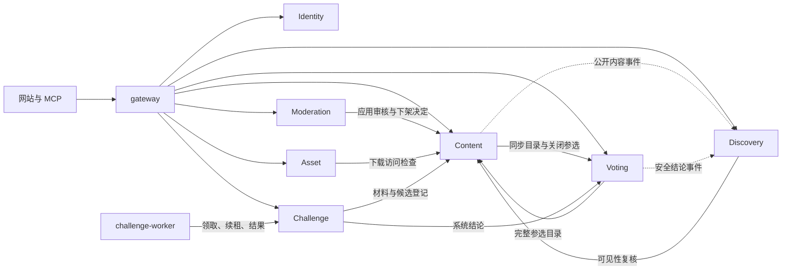

# Human Worth 后端架构划分

| 项目 | 内容 |
| --- | --- |
| 版本 | v1.2 · 2026-09-19 · 目标架构，Identity 已实现 |
| 本轮人类要求 | 以学习分布式微服务为目标，依据讨论重新编写架构划分、单机多节点部署计划和可模拟场景；先只使用一套实验配置 |
| 方案归属 | 七个业务服务、进程边界、数据归属、协作协议与实施顺序为 Agent Self-Claimed 的具体设计 |
| 产品依据 | [PRD](prd.md) 的 S1～S6、H1～H3；过审展示、完整候选单选、查看统计后永久禁投、隐藏额度、Google 登录 |
| 配套文档 | [部署与实验计划](deployment.md)、[Identity 设计](backend-identity.md)、[成熟参考](references.md#microservices-lab) |
| 当前实际状态 | 公网仍是 Node.js 基座与 Swagger；本机 kind lab 已运行 Go gateway、Identity 双副本及 PostgreSQL 三实例 |

本文是当前七服务划分的依据。各模块分别编写核心对象、状态机、功能逻辑和接口设计，再形成独立 Proto 文件；七服务契约尚未定稿。公开 HTTP 草案由 [OpenAPI](../openapi.yaml) 管理，Google 登录见 Identity 设计；Identity 的登录、会话和 MCP 凭据管理也已有代码，公开部署状态见统一部署文档。

模块详细设计从 [Identity](backend-identity.md) 开始，包含核心对象、功能逻辑、接口约定与 [platform 公共基座清单](backend-identity.md#platform)。[Identity Proto](../backend/proto/humanworth/identity/v1/identity.proto) 已实现；其余六服务契约逐项设计。

## 1. 划分结果与理由

采用 **七个业务 RPC 服务 + gateway + challenge-worker，共九类独立应用进程**。每类进程可运行多个副本；数据库、对象存储、观测组件和 Kubernetes 控制平面另计。源码可以保留在同一个仓库，使用一个 Go module、多个 `cmd/` 入口和独立镜像构建目标。独立部署不要求九个代码仓库。

| 进程 / RPC Service | 职责与拥有的权威数据 | 主要协作 |
| --- | --- | --- |
| `gateway` / 无业务 RPC Service | HTTP/MCP 协议适配、凭据转交、错误映射、管理概览的只读聚合；不拥有业务表 | 调用 Identity 认证，再按显式路由调用业务服务；概览聚合 Moderation 与 Challenge |
| `identity` / `IdentityService` | 账号、Google 身份关联及一次性登录流程、角色、会话、MCP 凭据、身份版本与断言 | 验证 Google 回调、签发/撤销网站会话；为业务服务验证主体、调用用途与当前凭据有效性 |
| `content` / `ContentService` | 任务、作品、投稿快照、评论、作品引用关系、权威展示状态、参选目录版本、云端登记开关与登记记录 | 核实 Asset 元信息；向 Moderation 投递审核请求；与 Voting 协调参选目录；接受受信 Challenge 登记 |
| `asset` / `AssetService` | 上传会话、文件元信息、摘要、存储对象、上传者与资产可用状态 | 管理对象存储；下载前向 Content 核实关联内容的访问资格；独立处理传输与资源限制 |
| `voting` / `VotingService` | 账号×任务永久资格、完整候选快照、当前选票、计票结果与系统结论 | 核实 Content 权威目录；向 Discovery、Challenge 提供不含具体票数的结论 |
| `moderation` / `ModerationService` | 审核案件与决定、举报完整生命周期、执行回执、跨服务审计查询投影 | 获取 Content 投稿快照；将决定交 Content 应用；消费各服务本地审计事件 |
| `challenge` / `ChallengeService` | 运行状态机、不可变配置、材料、工作项、租约、候选、内部预算账本、取消意图 | 读取 Content 授权与 Voting 结论；调度 worker；协调候选登记与终止 |
| `discovery` / `DiscoveryService` | 推荐与热度索引、查询快照、公开看板投影、事件消费进度 | 消费内容/结论事件；普通返回前向 Content 复核可见性；不拥有原始选票 |
| `challenge-worker` / 无业务 RPC Service | 按租约执行生成、验证、匿名对抗或经验提炼；仅保存可丢弃的工作目录 | 调用 Challenge 领取、续租、读材料、提交进度与结果；通过受控出口调用模型 |

划分依据：

- Content、Voting、Challenge 分别拥有内容生命周期、真人判断和长任务生命周期，保留独立数据与故障边界。
- Asset 独立承担文件传输；Moderation 独立承担管理员工作流，二者从原 Content 拆出。
- Discovery 独立处理推荐、热度和公开汇总。公开看板与具体计票的权限、副作用不同，不把二者合为普通统计入口。
- `Execution` 首版是 Challenge 的内部工作项/租约模块，沿用同一个运行所有者；worker 仍为独立进程。需要跨多个业务复用执行系统时再评估独立服务。
- `platform` 只表示可复用的技术代码，例如配置、日志、服务启停、数据库连接与遥测初始化；没有一个聚合所有业务的 `platform` 进程。基础代码不包含审核、投票或挑战规则。

上述边界按业务能力与数据归属选择，参考 [Microsoft 服务边界分析](https://learn.microsoft.com/en-us/azure/architecture/microservices/model/domain-analysis)。服务拆分增加的超时、一致性和恢复工作是本项目的学习内容，不能改变 PRD 规则。

## 2. 目标调用拓扑

图示省略每个服务到 Identity 的断言校验和数据库连接；线表示允许的业务协作，不表示一次请求必须走完所有服务。

同步 RPC 用于必须确认的身份、权限、权威目录和命令结果；outbox 事件用于审计和可延迟的索引。事件允许至少一次投递，按事件 ID 去重并按来源版本拒绝旧内容。先复用 PostgreSQL outbox 轮询投递，后续有消息系统学习目标时再引入中间件。

逻辑上允许 Content 与 Asset/Voting 相互协作，但单次处理链不能递归回调形成环：例如 `Asset.AuthorizeDownload → Content.CheckAssetAccess` 在 Content 只检查自己的关系与状态，不再次调用 Asset；Content 的资产元信息校验则调用无回调的 Asset 读取方法。数据库事务内不等待外部 RPC；需要恢复的跨服务步骤先记录持久化意图，再发命令。

## 3. 数据、权限与事务边界

### 唯一写入者

初期使用一个 PostgreSQL 集群、一个业务数据库，七个业务服务分别拥有 schema 和数据库账号。各服务只读写自己的 schema；跨服务读取走契约或已授权事件投影，不能通过 SQL join、共享 ORM 或跨 schema 事务绕过边界。这个选择隔离业务数据所有权，但数据库仍是共享故障域。

每个服务管理自己的迁移、唯一约束、outbox/inbox 和本地原始审计。Moderation 中的审计是可延迟查询投影，不能替代执行服务中的事实记录。gateway 和 worker 没有通用业务数据库写权限。数据库中的任务/账号/资产 ID 是跨服务引用，不产生跨 schema 外键依赖。

### 身份与数据投影

- Google 登录的浏览器跳转与 Cookie 由 gateway 适配，换码、ID token 验证、账号关联和会话生命周期由 Identity 负责。流程保存在共享数据库，两个副本均可接收回调；不要求粘滞会话。集群默认拒绝未声明出口时，须为 Identity 配置访问 Google 发现文档、换码和签名公钥端点的受控 HTTPS 出口；动态域名授权经出口代理处理。细节见 [Identity 设计](backend-identity.md)。
- 网关和内部调用者都使用可验证的服务身份；业务服务复核断言与自身权限。NetworkPolicy 只限制网络可达性，不能替代 mTLS、主体校验和管理员授权。
- 网站与 MCP 凭据绑定同一账号。MCP 工具保持内容读取与显式统计访问白名单；即使账号是管理员，MCP token 也不获得投稿、投票或运行管理权限。
- 具体统计只经 Voting 的显式入口返回；先提交永久禁投记录，再读统计并响应。普通详情、推荐、看板、日志、事件、管理概览不包含具体票数。
- 任务状态与作品审核状态由 Content 唯一写入。作品审核通过即允许展示，不恢复独立的公开/私有字段。云端使用授权保持独立用途。
- 管理概览与运行展示不显示额度余额或消耗；内部预算、预留与幂等结算仍由 Challenge 管理。

### 拆分后仍须成立的协议

| 跨模块流程 | 本地原子边界与跨服务完成条件 | 故障处理 |
| --- | --- | --- |
| 投稿送审 | Content 同事务保存待审投稿、不可变版本快照和审核请求 outbox；Moderation 按目标 ID＋版本幂等建案件 | 消息丢失可重发；案件暂未创建时仍显示待审，不能自动通过 |
| 应用审核决定 | Moderation 保存管理员决定及待应用命令；Content 核实决定来源、投稿版本与当前状态，同事务应用任务和初始作品审核结果 | Moderation 区分“决定待应用”与“已生效”；只有收到或查回 Content 回执才报告完成。旧版本决定拒绝，不覆盖新投稿 |
| 下架与参选 | Content 记录收紧意图并冻结目录；Voting 确认关闭相应参选项；Content 再提交下架/撤销审核状态；Moderation 以应用回执结案 | 网络故障保持收紧和待处理状态，不能提前声称下架完成；旧开放消息不能覆盖新版本墓碑 |
| 文件访问与封禁 | Asset 掌握文件可用性，Content 掌握作品可见性；每次新下载都核实两者。封禁影响参选时复用 Content 的收紧协议 | 任一必要权限查询失败则拒绝访问，不发长期公开 URL；上传中断的临时对象不成为可引用作品文件 |
| 投票与查看统计 | 资格、选票和目录副本都在 Voting；唯一键创建资格行，再用一致锁顺序串行化写票与永久禁投 | 多副本也使用数据库约束与锁；统计提交失败不返回结果；提交成功但响应丢失仍永久关闭 |
| 取消与候选登记 | Challenge 先冻结运行推进；Content 在同一事务检查登记开关并创建作品；封闭登记确认后 Challenge 才提交终态 | 取消期间拒绝新推进，重试只找回已有作品；终态后迟到结果无效；登记开关封闭后不可重新开放 |
| 索引和看板 | Discovery 的投影与消费位点同事务更新；返回内容前复核 Content 的可见性 | 重复、乱序事件不能复活下架内容；核实失败返回明确错误，不返回未经确认的旧缓存 |

投票候选必须是同一目录版本的全部过审作品，不用分页、抽样或双方配对代替。大集合需要在实现时验证消息大小和内存；无法完整返回时明确失败，不能悄悄截断。只有本人当前选择可随投票上下文返回。

新拆出的审核案件需要持久化待应用状态、决定 ID 和应用回执；它们属于内部协作状态，不能未经映射直接扩充现有 HTTP 状态枚举。详细字段和错误映射在七服务 Proto 定稿阶段一起验证。

## 4. 多副本如何工作

所有业务 RPC 进程按两个副本设计，服务实例不保存唯一的会话、投票资格、选票或运行状态。请求可落在任一副本；必要状态在所属数据库中持久化，缓存有明确失效与权限复核规则。

Challenge 的两个副本均可参与调度，通过数据库工作项领取和有限期租约协调；同一工作项同时只有一个有效租约持有者。调度器、outbox 发送者和 worker 都不能靠进程内 mutex 获得跨实例独占。租约代次单调增加，旧代次的续租或结果不能推进状态。worker 只执行领取到的工作，不能直接提交选票、审核作品、写业务表或调用 Content 登记接口。

同一外部模型调用发生超时，不代表供应方没有执行。供应方支持时使用执行 ID 幂等；结果未知时先核对执行记录，不能用无条件重试掩盖重复调用。受控执行器可用于大量故障实验，后续真实模型接入仍需单独验证材料授权、产物和失败行为。

## 5. 模块设计与接口约定

**Identity Proto 已实现，其余六服务尚未定稿。** 模块详细设计从 [Identity](backend-identity.md) 开始；后续以独立 `.proto` 文件作为 RPC 契约源，设计文档引用文件，不重复维护消息定义。

| 接口范围 | 负责方与约束 |
| --- | --- |
| Google 登录、会话与主体检查 | Identity；登录发起/回调只允许 gateway 调用，退出只撤销当前网站会话 |
| 管理概览 | gateway 聚合 Moderation 摘要与 Challenge 摘要 |
| 审计事件查询与接收 | Moderation 保存查询投影；各执行服务保留本地原始审计 |
| 上传、下载、文件元信息 | Asset；与 Content 约定关联内容访问检查及产物上传流程 |
| 审核、举报、下架决定 | Moderation；由 Content 应用决定并提供回执和投稿快照 |
| 任务、作品、评论、参选目录、材料与云端登记 | Content；独占内容状态写入 |
| 选票、永久资格、统计和系统结论 | Voting；资格与选票保持本地事务 |
| 挑战运行、工作项领取、续租、进度与结果 | Challenge；明确 worker 产物传输协议，不新增 ExecutionService |
| 推荐、任务查询、公开看板 | Discovery；只返回经过可见性核实的安全投影 |

契约定稿必须覆盖：全部 planned HTTP 操作的 RPC 对应关系、调用方与主体权限、超时、副作用、幂等键、版本冲突、流式传输、空值和错误映射。内部 Service 拆分不自动新增公开 HTTP/MCP 能力。已发布字段删除时保留编号与名称；发布后的破坏性变更采用新版本。

下一阶段重点检查三处跨模块协议：审核决定的应用与回执、资产/内容权限协作、worker 的进度与产物传输。Proto 编译通过不能代替运行时验证。

## 6. 实施顺序与完成条件

| 阶段 | 交付物 | 进入下一阶段的条件 |
| --- | --- | --- |
| A. 架构与计划 | 本文、部署与故障矩阵、接口职责清单 | 数据唯一写入者、关键事务和方案归属明确；文档与 PRD 无冲突 |
| B. 按模块定契约 | 七模块设计、Proto 文件、HTTP/RPC 对照、状态与失败用例 | 编译通过；请求/响应及权限边界校验通过；没有靠未定义 RPC 才能完成的关键流程 |
| C. 最小 Go 基座 | 配置、日志、gRPC/mTLS、健康检查、连接与迁移、遥测、CI；第一条真实内容链路 | gateway → 身份 → 内容 → 数据库真实读写，能拒绝无权限请求、处理超时、跟踪日志 |
| D. 核心业务 | Content/Asset/Moderation 发布审核闭环，Voting 资格与单选，Discovery 查询与看板 | 真实数据库并发、全部候选、统计副作用、审核/下架恢复通过；不能靠空服务或 mock 代替业务验收 |
| E. 挑战执行 | Challenge 状态机、租约、worker、产物登记 | 多副本领取、旧租约、重复结果、取消与登记竞争通过 |
| F. 集群演练 | 同一套 lab [实验计划](deployment.md#lab-plan) 的逐项实验证据 | 区分应用、数据库、单控制平面中断恢复；不宣称控制平面高可用；明确未完成项 |

当前已完成 Identity 的设计、9 个 RPC、核心实现、公共基座与独立 lab。后续按 Content → Asset/Moderation → Voting → Discovery → Challenge/worker 逐模块定契约、实现和验收；不等待所有 Proto 一次性定稿。公网新增 worth.oopsbox.cn 的 HTTPS 入口仍连接受保护 dev 的基座，Go 公开上线待发布；创建 PR 仍必须收到覆盖相应改动的人类命令。
