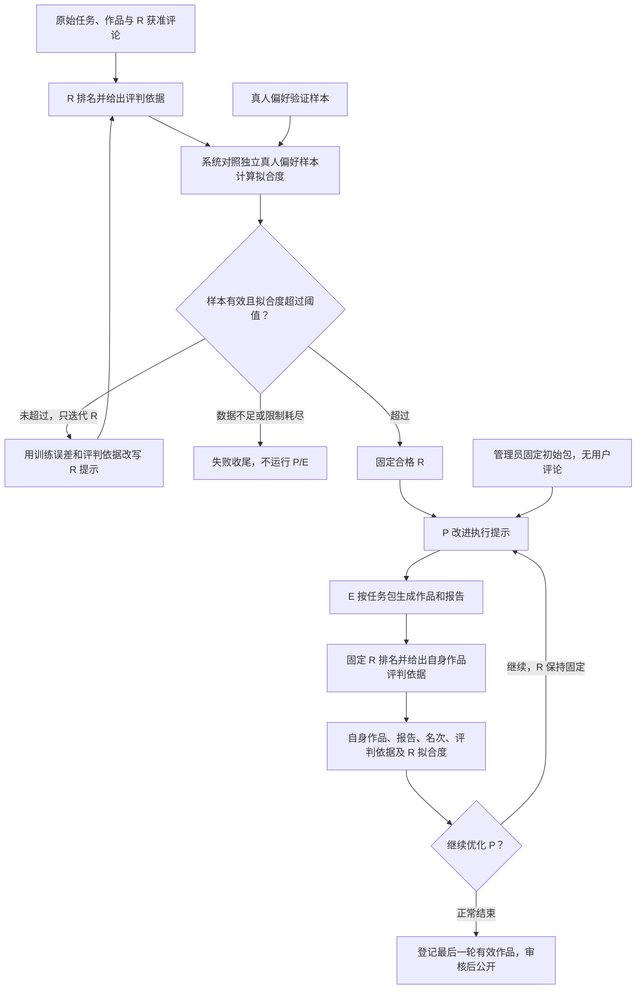

# Challenge 设计：打包、执行、排序三个 agent

| 项目 | 内容 |
| --- | --- |
| 版本 | v0.10 · 2026-09-20 · 三角色统一 Completion，未发布 |
| Human Design | 统一追求成为最佳或对齐最佳效果；P 不接收任何用户评论；先只迭代 R，拟合度超过阈值后固定 R、只迭代 P 并运行 E；R 提供评判依据与真人偏好拟合度；P/R 可按需使用 ReAct，工具按实际需要设计；管理员准备初始包；角色隔离；先定 Proto 再 mock；测试服务统一使用 Completion |
| 当前方案 | P/R 默认普通模型调用，需要按需读材料时使用一个共享读取工具完成 ReAct；只有 E 使用工作区与 harness；只维护当前提示，按先 R 后 P 的阶段覆盖；不保留历史版本或回滚 |
| 产品依据 | [PRD S4、H1、H2、H4～H11](prd.md)：管理员启动、统一目标、先 R 后 P、按需使用 ReAct、产物审核、终态拒绝迟到结果、隐藏额度及角色边界 |
| Agent Self-Claimed | DTO 与 RPC 名称、评分公式和阈值配置、验证数据划分、拟合记录绑定、P 专用评判调用、单一材料读取工具与循环限制、阶段及错误处理、Completion 执行循环、隔离与实验参数 |
| 当前状态 | Identity 与基础 lab 已上线；Challenge 核心、P/R worker、最小依赖 Proto 与有状态 fake 已实现；E 的 Job/Completion 适配器已编写，真实模型工具往返已验证，真实沙箱未验收；未做优化效果实验 |
| 配套 | [架构划分](backend-architecture.md)、[部署计划](deployment.md)、[OpenAPI 草案](../openapi.yaml)、[技术参考](references.md#challenge-design) |

阅读顺序：**依赖 DTO → 核心对象 → 核心功能中 DTO 的用法 → 状态与执行细节**。DTO 用字段表说明；RPC 名称和协议规则放在文末附录，实现时再查。

## 1. 依赖 DTO：其他模块给 Challenge 什么数据

DTO 是模块之间传递的数据结构。这里按“数据从哪里来、字段是什么意思、在哪个功能使用”阅读；`[]` 表示列表，`?` 表示可空，ID 与摘要均为字符串。字段使用 camelCase 展示，不写 Proto 字段编号或序列化语法。

Identity 的字段来自已实现的 `Principal`；其余 DTO 是原有依赖契约的字段整理，尚待对应模块实现。DTO 名称用于说明业务数据，不要求新增一层转换框架。

### 1.1 文件与作品：Asset、Content

| DTO / 提供方 | 主要字段与类型 | 用途 |
| --- | --- | --- |
| `AssetDTO` / Asset | `assetId: string`、`filename: string`、`mediaType: string`、`bytes: int64`、`sha256: string` | 说明文件身份、类型、大小和内容摘要；正文通过有界流传输，不塞进元数据 |
| `ArtifactDTO` / Content，文件引用由 Asset 校验 | `kind: text / file / link`；文字用 `text: string`，文件用 `assetId: string`，附加链接用 `url: string` | 沿用作品交付结构；至少有文字或文件，链接只作补充，不自动抓取 |
| `TaskAttachmentDTO` / Content | `asset: AssetDTO`、`cloudUseAllowed: bool` | 标明这是任务描述的附件，以及是否允许云端使用；与作品附件分开 |
| `WorkDTO` / Content；云端产物由 Challenge 组装同一结构 | `workId: string`、`artifacts: []ArtifactDTO` | 给 R 评审作品；给 P 时只选本 Run 自身产物，不附作者、human/agent 标记或执行配置 |

有文件 ID 不等于有权读取。每次传输仍检查归属、用途和当前授权，结果文件还须核对大小与摘要；这些检查不由模型判断。

### 1.2 原始任务、评论与材料权限：Content

| DTO | 主要字段与类型 | 用途 |
| --- | --- | --- |
| `TaskDescriptionDTO` | `taskId: string`、`revision: int64`、`description: string`、`taskAttachments: []TaskAttachmentDTO` | 管理员从中选文件并写初始包；R 读取原任务；不含参赛作品 |
| `WorkListDTO` | `taskId: string`、`catalogRevision: int64`、`works: []WorkDTO` | 取得当前完整作品集合，不能只取部分作品进行排序 |
| `CommentDTO` | `commentId: string`、`body: string` | 只供 R 的内部排序／训练使用，P/E 和面向 P 的评判调用均不接收 |
| `CommentListDTO` | `taskId: string`、`revision: int64`、`cutoffAt: 时间`、`comments: []CommentDTO` | 固定 R 的评论范围；筛掉越权引用，不自动展开外链 |
| `MaterialAccessDTO` | `allowed: bool`、`allowedAssetIds: []string`、`authorizationVersion: string` | 对本次用途与材料清单的校验结果；拒绝或查询失败就不下发材料 |

这些数据分别获取。服务端只把管理员选定的任务附件放入 P/E 输入，不能把 `WorkListDTO` 合并进去。分页、读取过程中版本变化和完整性检查由依赖接口处理，交给核心功能时必须已形成完整集合。

### 1.3 管理员身份：Identity

`PrincipalDTO` 对应现有 `VerifyActor` 返回的 `Principal`，只接受 Identity 验证结果，不接受用户自报身份。

| 字段 | 类型 | 核心功能怎样用 |
| --- | --- | --- |
| `accountId` | string | 写入运行的操作人 |
| `role` | user / admin | 启动、取消、重启、登记要求 admin |
| `clientKind` | anonymous / web_session / mcp_read | 管理操作要求 web_session；MCP 凭据不能执行 |
| `credentialId` | string | 标识本次验证的凭据，不传给 agent |
| `authVersion` | int64 | 由 Identity 检查身份有效性，不由 Challenge 自行伪造或长期缓存 |

### 1.4 真人监督：Voting

| DTO | 主要字段与类型 | 用途 |
| --- | --- | --- |
| `HumanPreferenceDTO` | `taskId: string`、`taskRevision: int64`、`workSetHash: string`、`voteWindow: 时间范围`、`countsByWork: map<string, int64>`、`validVoteCount: int64`、`policyVersion: string`、`sourceVersion: string` | 给 R 的提示词训练及可信评分器提供真人监督；普通运行响应、P/E 和正式排序输入均不含这份数据 |

Challenge 从 Voting 取得真人监督数据，用于校准 R。`HumanPreferenceDTO` 必须绑定同一作品集合和投票窗口；网站、管理员和 MCP 查看具体统计仍须先永久关闭该题投票资格。

### 1.5 登记与审核回执：Content

| DTO | 主要字段与类型 | 用途 |
| --- | --- | --- |
| `RunRegistrationDTO` | `runId: string`、`state: open / closed` | 确认该 Run 能否登记作品；closed 不可重新打开 |
| `RegistrationReceiptDTO` | `runId: string`、`candidateId: string`、`entryId: string`、`reviewId?: string`、`reviewState: 审核状态`、`created: bool` | 找回已登记作品，避免重复投稿；reviewId 可因审核异步建立而暂为空 |

Moderation 通过 Content 的审核请求接入。Challenge 只读登记回执中的当前审核状态，不直接创建或修改审核决定。

## 2. 核心对象：Challenge 自己维护什么

### 2.1 三个角色与系统职责

**所有 Challenge 都以成为最佳作品或对齐最佳效果为目标。** 以完整作品集合为比较参照，按同一流程迭代；人类或 agent 谁领先不作为运行输入。

**先让 R 排名并给出评判依据，用真人偏好拟合度指导 R 自我迭代；超过阈值后固定 R，再由 P 改提示、E 交作品、R 评测并反馈给 P。** 管理员初始包固定；P 始终不接收任何用户评论。

输入先分清两类：**任务描述**是要做什么及其附件；**作品**是对任务的回答。评论仅用于 R 的内部排序／训练，真人投票是 R 的监督信号；二者都不能进入 P/E 的上下文。

| 角色 | 允许看到 | 产出与目标 | 首版运行方式 |
| --- | --- | --- | --- |
| 打包 agent P（packer） | 管理员初始包、当前任务包、最近一轮自身作品／报告／名次、合格 R 的自身作品评判依据与拟合度；不含任何评论 | 只在 R 达标后改进执行提示，追求最佳或对齐最佳效果；不改初始要求 | 模型调用，按需用 `read_material` 查阅本次获准材料；输出结构化提示，不建工作区、harness 或独立 Pod |
| 执行 agent E（executor） | 本次任务包；执行过程中自己的文件与工具结果 | 完成任务、交付作品；不负责优化策略，不接收排名反馈 | 独立 Job/Pod、工作区与 completion-shell harness，仅提供 run_command |
| 排序 agent R（ranker） | 内部排序／训练看原始任务、获准评论与全部作品；给 P 的评判调用只看任务要求和自身作品，见第 3.4 节 | 输出完整排名和评判依据，取得可信评分器计算的拟合度；第一阶段自我迭代，达标后固定评测 E | 模型调用，按需用同一 `read_material`；不同用途分别授权，不建工作区、harness 或独立任务 Pod |

三个角色不新增三个业务服务，也不要求三个 agent 框架。**第一阶段只改 R 的排序提示；第二阶段固定 R，只改 P 的执行提示并运行 E。** 管理员初始包、E 的模型、harness、skills 与基础提示全程固定。E 在任务内部可以规划、修改文件和运行工具，这属于完成作品，不是跨轮策略优化。

| 系统部件 | 负责什么 |
| --- | --- |
| `ChallengeService`，Go，两个副本 | 保存 Run、管理员初始包、当前任务包与排序提示词、阶段、输入清单、工作项与租约、预算、排名反馈、登记与审计 |
| `challenge-worker`，Go，两个常驻副本 | 按租约执行工作项：P/R 使用模型调用及可选的受限材料读取循环；E 建删固定模板 Job；续租、验证输出、上报结果并恢复清理 |
| 临时执行 Pod | 只用于 E 的一次执行尝试；运行 Completion 执行循环与本次命令工具，不持有其他角色的资料、业务库密码或集群管理权限 |

一次 Run 可有多个工作项。外层提示迭代由 Challenge 驱动；P/R 在一个 Attempt 内可保留本次 ReAct 的工具调用与返回，跨角色、用途和 Attempt 不共享模型历史。只有 E 的每次 Attempt 新建隔离环境，环境销毁后业务记录和作品仍保留。

### 2.2 业务对象与运行对象

Challenge 独占 PostgreSQL 的 `challenge` schema，保存运行和当前迭代状态。第 1 节的 DTO 来自其他模块，这里只留当次输入及校验所需信息，不跨 schema 读表或建外键。

| 对象 | 核心字段 | 必须成立的规则 |
| --- | --- | --- |
| `ChallengeRun` | `id, task_id, parent_run_id, administrator_id, status, stage, ranker_round, round, ranker_evaluation_id, version, configuration_id, terminal_target, timestamps` | 第一阶段仅执行 R 工作项；有效拟合记录过阈值后才开始 P/E；重启新建 Run，终态不可重新开放 |
| `RunConfiguration` | `initial_task_package_id`、P/R 模型与初始 prompt、E 模型／harness／镜像／skills、`ranker_fit_threshold, ranker_round_limit, ranker_min_comparable_pairs`、P 轮数、预算、期限与策略版本 | 创建时冻结，阈值和样本下限无隐含默认值；初始包与 E 全程固定；密钥只保存引用 |
| `InitialTaskPackage` | `id, task_id, task_revision, description, task_attachment_refs, work_requirements, prepared_by, hash` | 从任务 DTO 绑定任务与描述版本；管理员手写说明和作品要求、选任务附件；开始后不可变 |
| `WorkSetSnapshot` | `id, task_revision, catalog_version, work_refs, source_versions, count, hash` | 保存完整评测集合与顺序映射；只向 R 提供作品内容，不夹带任务包或来源配置 |
| `TaskPackage` | `run_id, initial_package_id, execution_hints` | 只保存当前执行提示；固定部分由服务端原样装入，P 无权改动 |
| `ExecutionReport` | `id, attempt_id, round, report_ref, main_artifact_paths, hash` | E 写 report.md 说明关键决策与最终结果；worker 校验文件归属及大小；只给 P，不给 R，不归档完整执行轨迹作为优化输入 |
| `RankerPrompt` | `run_id, text, hash, frozen_at?` | 第一阶段有效改写直接覆盖；达标后冻结，第二阶段不得改写；hash 绑定拟合证据，不保存历史提示 |
| `JudgmentDTO` | `workId, criteria, rationale, evidenceRefs` | 给出评判标准、简短理由及作品证据位置；不要求隐藏推理；证据必须属于被评作品与允许的任务材料 |
| `RankingResult` | `id, work_item_id, round, work_set_id, ordered_work_ids, judgments, ranker_prompt_hash, digest` | 全部输入作品恰好出现一次且各有评判依据；R 不自报拟合分数 |
| `OwnRankFeedback` | `run_id, round, own_work_id, ranking_result_id, rank, population_size, judgment, ranker_fit_score, evaluation_id` | 自身名次来自完整排序，judgment 来自无评论的独立 R 调用，fit 来自有效拟合记录；不含评论、他人作品或真人票数 |
| `EvaluationRecord` | `id, run_id, ranker_round, ranker_prompt_hash, config_hash, input_policy_hash, snapshot_hashes, fit_score?, comparable_pair_count, threshold, status, computed_at` | 可信评分器计算并绑定当前 R 与验证数据；输入策略包含工具范围及循环限制；只有有效且过阈值的记录可放行 P/E；数据不足用空分数，不伪造 0 或 1 |
| `Candidate` | `id, run_id, source_attempt_id, round, executor_config_hash, artifact_manifest, registration_state, entry_id, review_id` | 只从 E 的有效产物产生；登记唯一键为 `run_id × candidate_id`；不自动过审 |

任务包与排序提示各保留当前值，没有历史提示词表、父子版本或晋升状态。每轮串行更新，已领取的工作项完成前不更换其输入；当次提示词只在执行／重试需要期间保留，结束后不另存历史副本。Run、作品、报告、排名、授权摘要与幂等回执按业务需要保留。任务包不自动作为作品附件公开。

| 运行对象 | 核心字段与约束 |
| --- | --- |
| `WorkItem` | `id, run_id, kind, role, round, input_manifest_hash, state`；kind 为 `PACK_TASK / EXECUTE_PACKAGE / RANK_WORKS / EXPLAIN_OWN_WORK / REFINE_RANKER / VALIDATE_RANKER`，由服务端固定角色、阶段与运行方式 |
| `ExecutionAttempt` | `id, work_item_id, worker_instance_id, lease_epoch, expires_at, mode, job_uid?, deadline, result_digest`；mode 为 `MODEL_CALL / SANDBOX_JOB`，只有 E 有 Job；旧代次不能提交有效结果 |
| `TaskAccessGrant` | `attempt_id, role, purpose, allowed_refs, execution_instance_id, token_hash, expires_at, revoked_at`；模型调用的授权由可信适配器持有，只有 E Pod 获得受限任务凭据 |
| `BudgetReservation / ModelCall` | `run_id, attempt_id, request_id, unit, reserved, settled, outcome`；内部账本，未知结果保留预留，不重复计账 |
| `Command / Outbox / Audit` | 幂等键、摘要、预期版本、待发送命令与回执；状态与命令同事务，审计不保存密钥或真人票数 |

`Candidate.registration_state` 沿用 `unregistered / registered / discarded`；等待回执是内部命令状态。`review_id` 可以暂为空：Content 提交待审作品及审核请求后，Moderation 异步建立案件。

HTTP 配置为 `initialTaskPackage / packer / executor / ranker / rankerFitThreshold / rankerMinComparablePairs / rankerRoundLimit / roundLimit / budget`。阈值、最少可比作品对数与两阶段轮数由管理员显式提交，启动后不能降低门槛；预算和期限覆盖两阶段。P/R 使用模型调用配置，E 使用执行配置；客户端不能用自由参数扩大输入权限。

## 3. 核心功能：DTO 怎样进入流程、对象怎样变化

### 3.1 管理员准备初始包

**依赖 DTO：** `TaskDescriptionDTO`、`TaskAttachmentDTO`。**产出对象：** `InitialTaskPackage`。

管理员从 `taskAttachments` 中选 `asset.assetId`，将 `revision` 填入 `taskRevision`，再手写 `description` 与 `workRequirements`。例如任务有两份描述附件，管理员只选一份，P/E 就只收到这一份；其他参赛作品不参与组包。

管理员提交的初始包字段如下，服务端另补充任务绑定、操作人和摘要：

| 字段 | 谁填写／校验 | 含义 |
| --- | --- | --- |
| `taskRevision` | 管理员提交，Content 校验 | 选材依据的任务版本；版本冲突先重新核对 |
| `taskAttachmentIds` | 管理员选择，服务端校验归属和用途授权 | 只能从该版本的任务描述附件中选；允许空列表，不接受作品附件或任意新 asset ID |
| `description` | 管理员手写 | 自足的执行任务说明，不夹带其他作品、评审提示或投票结果 |
| `workRequirements` | 管理员手写 | 交什么、文字还是文件、文件格式与内容要求；例如“提交 result.md 和可运行源代码，不只交链接” |

**管理员负责作品要求，P 负责执行提示，E 负责交付。** 首版先由人核对说明是否忠实于原任务、选材是否足够；服务端校验字段和文件来源，不能声称能自动判断管理员文字没有抄入其他作品。任务信息不足时不让 P/E 去作品库找答案。修改初始包须新建 Run，不能让 P 为提高名次而改题或降低要求。

R 达标后，P 首轮为管理员初始包补充 `execution_hints`，后续每轮根据自身反馈改写一次；服务端校验后覆盖当前提示并组装任务包，不接受模型输出替换固定字段。初始包不能用来转交用户评论。R 仍按原始任务与作品评审，不读取管理员初始包或执行提示；内部交付格式由服务端／审核流程另行核验。

### 3.2 启动与重启

**依赖 DTO：** `PrincipalDTO`、`TaskDescriptionDTO`、`MaterialAccessDTO`、`RunRegistrationDTO`；训练与验证使用 `HumanPreferenceDTO`。**创建对象：** `ChallengeRun`、`RunConfiguration`、首个 `WorkItem`。

先用 `role / clientKind` 判定管理权限，以任务 `revision` 与授权结果确认初始包可用。收到 `RunRegistrationDTO.state = open` 后才让 Run 进入 active，从 R 拟合阶段开始，返回运行记录给管理员。

1. gateway 验证网站会话、Origin/CSRF，取得面向 Challenge 对应方法的 Identity 断言；Challenge 再调用 `VerifyActor`，要求管理员和网站用途。MCP 不能启动、取消、重启或登记。
2. 解析请求并查已受理的幂等命令：同键同摘要返回原 Run，不重复准备或执行；同键不同摘要返回 409。首次受理才校验管理员提交的初始包、显式轮数与预算、服务器允许的模型／harness／skills、参数和资源策略。客户端不能传任意镜像、API 地址、Secret 名称或 shell 命令。
3. 分别读取 Content 的任务描述、R 使用的评论和完整作品清单；校验初始包的 taskRevision、选定附件归属与用途授权。向 Voting 获取 R 训练和独立验证所需的真人样本，不查询任务领先结论；首次受理时若已能确认样本不足则拒绝启动。依赖失败返回明确错误；不把错误或无数据当作 R 达标。P/E 的清单只从管理员初始包及获准的自身反馈派生，没有评论字段或评论读取权限。
4. 在本地事务中按 `administrator_id × operation × idempotency_key` 创建 `queued` Run、配置／材料引用、审计与准备命令；同键同请求找回原 Run，不同请求 409。
5. 事务提交后调用 Content 幂等准备登记通道，复核材料与配置版本；确认成功才转 `active` 并生成首个工作项。事务内不等待外部 RPC。

重启只接受已终止 Run，创建新的 `parent_run_id` 关联；管理员显式提交初始包、拟合门槛和两阶段限制，重新校验全部条件，并从 R 拟合阶段开始。不继承旧运行的授权、达标记录、租约或登记通道。

### 3.3 先 R 后 P 的整体工作流

**输入 DTO：** 下表按角色准备。**更新对象：** `TaskPackage`、`RankerPrompt`、`ExecutionReport`、`RankingResult`。

| 输入 DTO | 从哪里取字段 | 结果与对象变化 |
| --- | --- | --- |
| `PackTaskInput` | `InitialTaskPackage`、当前执行提示、最近一轮自身 `WorkDTO / ExecutionReport / OwnRankFeedback`；不含任何用户评论 | `PackTaskResult`，只含新的执行提示；校验后覆盖当前提示，固定部分由服务端原样封装 |
| `ExecutePackageInput` | 本次工作项固定的 `TaskPackage`；执行控制配置独立由 worker 管理 | `GeneratedWork`，作品使用 `artifacts: []ArtifactDTO`，另带独立 report.md 引用 |
| `RankWorksInput` | `TaskDescriptionDTO`、R 获准的 `CommentDTO` 列表、完整 `WorkDTO` 列表；不含任务包和真人目标 | `RankingResult`，全量 `ordered_work_ids` 与每件作品的 `JudgmentDTO` |
| `ExplainOwnWorkInput` | Content 原始任务要求、管理员选定且本次获准的任务附件、自身 `WorkDTO`；不含评论、其他作品、全量排序理由、任务包或执行报告 | 同一固定 R 在独立调用中返回自身 `JudgmentDTO`，与名次、拟合记录合成 `OwnRankFeedback` |
| `RefineRankerInput` | 训练任务／评论／作品、当前提示、R 的排名与评判依据、授权真人目标及训练误差、最近验证拟合度 | 仅第一阶段可返回 `RefineRankerResult`，校验后覆盖当前 R；不回显原始标签或训练作品身份 |
| `ValidateRankerInput` | 未用于提示改写的无标签验证输入及当前 prompt；agent 侧复用 `RankWorksInput` | 可信评分器对照隐藏真人目标生成 `EvaluationRecord`；拟合度由系统计算，R 获得评测结果 |

P/R 的直接调用或 ReAct 都在同一个工作项内完成，最后仍返回表中的结构化结果；工具调用不计为新的提示优化轮次，也不能提前启动 P/E。

每个 Run 只维护一份当前任务包和一份当前排序提示。**先得到善于排名的 R，再得到优秀的 P**，两类提示不交替改写：

| 步骤 | 执行动作 |
| --- | --- |
| 1. 只评测 R | R 对真人样本对应的完整作品集排名并写评判依据；系统计算有效拟合度，P/E 尚未运行 |
| 2. 未达标只改 R | `fitScore <= threshold` 时，用训练误差、评判依据和拟合反馈改写 R，校验后覆盖；回到第 1 步；样本不足或限制耗尽则失败收尾 |
| 3. 达标固定 R | `fitScore > threshold` 且样本、授权、记录绑定有效时冻结 R 的提示、配置与输入规则，保存达标记录，开始第二阶段 |
| 4. P 打包、E 执行 | P 用固定初始包及上轮自身反馈改写执行提示，E 按任务包交付作品和报告；没有评论输入 |
| 5. 固定 R 评测 | R 排序全部作品；同一 R 的独立无评论调用给出自身作品评判依据，系统连同自身名次、作品／报告和有效拟合度反馈给 P |
| 6. 只迭代 P 或结束 | 允许继续则回到第 4 步，R 与 E 配置保持固定；正常结束登记最后完成一轮的有效作品 |

有效的新提示直接用于下一轮，不执行多候选搜索、新旧对照、择优保留或自动恢复旧提示。格式错误、越权输入、无法排序全部作品等仍是执行错误，按既有重试规则处理，不能以“保持简单”为由接受非法结果。

第一阶段受 `rankerRoundLimit` 限制，未达标不能以“轮数用完”为由进入第二阶段；第二阶段受 `roundLimit` 限制。期限、预算和取消约束整次 Run。正常结束登记最后完成一轮的有效作品，不搜索历史最佳作品；失败／取消按终止协议处理。R 达标只证明声明验证条件下的拟合表现，E 作品是否达到最佳仍须作品比较与真人反馈支持。

#### 作品与执行报告怎样传递

作品使用统一的交付结构：文字内容和／或 Asset 文件引用。P 的自身作品和 R 的全部作品都用这套结构，worker 按授权读取文件、作为模型输入提交；需要按需查阅时，`read_material` 复用相同的材料读取与输入适配能力，不另建作品浏览系统。外链可以作为文字中的参考或附加说明，不自动抓取外链来代替实际作品。

E 同时交一份 `report.md`，写清关键决策及简短理由、最终结果、主要文件、检查结果与已知不足。报告供 P 理解自己的产物，不要求完整轨迹或隐藏推理；报告里的成功声明仍以作品和证据为准。首版报告上限 16KiB，是待测参数。R 只收到作品，报告不进入排名材料，也不自动登记为公开附件。

作品文字与文件引用在结果接收时冻结，绑定 Run、轮次、E Attempt 和内容摘要。P 与 R 看到的是同一份最终产物；E 的临时文件、会话、配置和原始日志不作为反馈。P 改提示后执行下一轮须建立新工作项，不能伪装成幂等重试。

“可以提交”应当对应可读取的正文或完整文件。格式解析及模型输入适配由统一材料处理负责；若选定模型无法接收某份文件、材料缺失或超出上下文，明确报告不可评测，不用文件名、报告摘要或截断片段冒充已读完作品。首版不增加专门供 P 浏览工作区的系统；具体支持格式在实现这一公共输入能力时验证。

任务包包含不可修改的管理员初始包和 P 给出的执行提示。P 没有评论字段、评论读取权限或评论上下文；不能通过初始包或评判反馈转交评论，也不能附带作品库、排行表、R prompt 或投票标签。E 每次从空的独立会话执行，跨轮只接收 P 当前执行提示；自己的工具结果只用于当前任务。

评论仅进入 R 的内部排序／训练，不能成为 P/E 或面向 P 的评判调用的输入。R 的评论输入不自动展开链接或附件；省略转载任务包、执行报告和正式投票表的越权材料。普通评价仍是用户观点，不当作官方票数。验证评论截点与标签窗口分开，记录评论间接透露偏好的局限。

任务附件和作品输入均由可信服务按角色清单准备，不执行附件代码，不自动打开外链。P/E 的文件权限只覆盖管理员选定的任务附件及各自获准的自身产物；公开作品接口也不能成为旁路。作品输入剥离作者、human/agent 标记、模型／prompt 配置等旁路信息；正文中的身份线索仍要记录为评测局限。

### 3.4 排序与评判依据怎样反馈给 P

**依赖 DTO：** `TaskDescriptionDTO`、筛选后的 `CommentListDTO`、完整 `WorkListDTO`，加上本 Run 的有效 `GeneratedWork`。**输出对象：** `RankingResult`、`OwnRankFeedback`。

Challenge 将作品合成 `WorkSetSnapshot`，给固定且达标的 R 构造 `RankWorksInput`。收到 `ordered_work_ids` 与 `judgments` 后，校验全部作品恰好出现一次、每件都有评判依据且证据引用有效；按自身 `workId` 取名次。第一阶段也用相同输出契约评测真人样本，但不调用 P/E。

R 输出 `ordered_work_ids`，从最好到最差，是当前 `WorkSetSnapshot` 全部 ID 的一个排列。集合由同一目录快照中可展示且获云端评测授权的全部作品，加上本次内部实验产物组成；任一必需作品未授权或不可读则本次排序不可用，不悄悄缩小集合。未审实验作品只在受控排序中使用，不进入公开投票。

R 的评判依据写清任务标准、作品中支持判断的证据与简短理由，不要求完整隐藏推理。只有名次、没有依据或引用不属于该件作品的证据均视为无效结果。全量排序及其理由保留在内部，不能把他人作品的内容或评论带给 P。

为落实 P 完全不看评论的要求，**给 P 的评判依据由同一固定 R 另做一次独立无历史调用**，使用 `ExplainOwnWorkInput`：只含 Content 原始任务要求、管理员选定且已授权的任务附件与本轮自身作品；没有用户评论、其他作品、完整排序理由或真人标签，也没有管理员任务包、P 执行提示及 E 报告。该调用只解释自身作品对任务要求的符合程度，不另做全量排名。这个模式的输入规则在 R 准入时一同校验并冻结，不增加第四个 agent。

Challenge 合并自身 `JudgmentDTO`、从完整排序提取的名次和集合大小、可信 `EvaluationRecord` 中的拟合度，再附自身作品／报告，得到 `OwnRankFeedback`。拟合度是这个 R 的验证表现，不是本轮 E 新作品的人类得票率；新作品没有真人投票时也不能伪造一个作品拟合分数。P 反馈不附带原始标签或验证集作品身份。

不同作品集合的名次不能直接当作进步证据；不为此重复执行旧包作对照。格式无效、材料不可读、无合规评判依据或拟合记录失效时拒绝反馈，不用空理由或旧分数继续驱动 P。

网站投票仍是全部过审作品中单选一件；**R 的内部全量排序不会把用户投票改成拖拽排序，也不会写入真人选票。**

### 3.5 用真人偏好先得到合格 R

**依赖 DTO：** `HumanPreferenceDTO` 与对应的任务、评论、作品 DTO。**更新对象：** `RankerPrompt`；验证时写 `EvaluationRecord`。

服务端按 `workSetHash / voteWindow` 核对可比样本，用 `countsByWork` 形成真人群体偏好目标。R 先输出完整排名与评判依据，可信评分器再计算拟合度并交还评测结果；模型不能自报分数或通过标志。未达标时，将授权训练样本的排序误差、R 的评判依据与最近拟合反馈交给 `RefineRankerInput`，校验后覆盖当前提示，再验证。第二阶段禁止 `REFINE_RANKER`。

`HumanPreferenceDTO` 来自 Voting 的受限服务接口，不直接读 Voting 的表，也不返回投票者身份。

真人当前投票是单选，能够观察到的是**同一可比候选集合的得票分布**。首版用得票由高到低的次序监督 R；它表示该样本的集体偏好，不等于每位用户给出了完整排序。同票或证据不足的作品对不强行指定先后；无足够有效票时不给出“已拟合”结论。新增作品、不同候选曝光集合、不同投票窗口的原始票数不能直接混合比较。

真人样本不足时，拟合度标记为不可计算，P/E 不运行。受理前能确定则拒绝启动；已运行后发现样本不足、授权失效或独立验证样本耗尽则失败收尾，由新 Run 重新准备。RPC 失败独立报告，不能伪装成数据不足、0 分或通过。

两阶段中的输入分别如下：

| 模式 | R 得到什么 | 平台做什么 |
| --- | --- | --- |
| 第一阶段 prompt 改写 | 训练任务、当时评论、作品、当前排名与评判依据、允许的真人目标与误差、最近拟合度 | 生成一份新排序提示，格式及权限校验后直接覆盖，再验证 |
| 第一阶段验证 | 独立任务、截止评论与完整作品集，不提供真人目标 | 隐藏标签留在可信评分器，计算拟合度；过阈值才冻结 R 并放行 P/E |
| 第二阶段固定评测 | 当前任务和完整作品集；P 专用解释另用无评论、仅自身作品的输入 | R 提示及模型配置不变，只产出评测反馈；不再改写 R |

训练和验证按任务分开，评论截点早于目标投票窗口。准入评测使用尚未参与提示改写的验证批次；一旦其结果被用于改写反馈，该批次不再作为后续独立准入证据。不得反复对同一暴露验证集调提示，再将高分声称为泛化证明；独立样本耗尽不能放行。相关取舍见[成熟参考](references.md#challenge-design)。没有真实数据时可用合成数据开发 mock，不能报告拟合真人成功。

首版沿用可比作品对的顺序一致率：`fitScore = 与真人目标同序的作品对数 / 可比作品对总数`，范围为 0～1。同票、证据不足与不可比作品对不进入分母；同一作品对只计一次，不混合不同目录／窗口的原始票数。`rankerMinComparablePairs` 是启动时固定的正整数样本下限，不满足时分数为空。

`rankerFitThreshold` 由管理员显式配置为 0 与 1 之间的数，不预设 80% 等默认值。**只有有效的 `fitScore > rankerFitThreshold` 才达标，等于阈值仍只迭代 R**；比较使用未四舍五入的值。最低样本量及阈值需用代表性数据验证，不能把少量样本的高分等同稳定能力。

达标记录绑定当前 R 提示摘要、模型／参数、输入规则（含工具 schema、授权范围、材料适配与循环限制）、验证数据快照和计分策略。同一策略内允许模型按需调用读取工具；工具或策略改变必须重新校准，不能沿用旧高分。冻结 R 与切换阶段在同一 Run 事务中完成；创建、领取和提交 P/E 工作项时都校验有效达标记录。第二阶段记录失效则停止推进并失败收尾，不能使用旧高分或偷偷改写 R；重新校准需新 Run。只保留当前提示和证据元数据，不恢复历史提示版本或择优回滚。

训练标签只进入专用 R 训练请求与可信评分器，不进入 P/E、普通运行响应、模型调用日志或公开制品。R 的正式排序输入不能带上本题真人目标来照抄。用户、管理员和 MCP 显式读取单题统计仍走永久禁投资格入口；该机器训练契约不映射为 HTTP/MCP 统计旁路。

只借鉴 [ProTeGi](https://aclanthology.org/2023.emnlp-main.494/) 和 [TextGrad](https://arxiv.org/abs/2406.07496) 的文字反馈改写思路，不引入候选搜索框架。R 先用真人监督改排序提示；达标后，P 用自身作品／报告、合规评判依据、名次及 R 拟合度改执行提示，E 专注完成作品。

这是提示词迭代，不训练模型权重。作品仍须登记、审核和真人投票；内部排序不写真人选票，也不能直接证明人类更喜欢生成结果。

### 3.6 上传与登记作品

**依赖 DTO：** `AssetDTO`、`MaterialAccessDTO`、`RunRegistrationDTO`、`RegistrationReceiptDTO`。**读写对象：** `Candidate`。

把 `GeneratedWork` 中的文字与已完成上传的文件变成候选；以 `runId × candidateId` 登记或查回。收到回执后将 `entryId / reviewId` 写入候选，并设为 registered；`reviewState` 仍可能是 pending_review，登记成功不等于过审。

大文件走有界流式传输，不塞进单条 DTO 消息。输入文件与输出文件使用 `attempt_id` 限定的授权，中继只允许读取清单中的输入、上传本次输出；Asset 完成长度／摘要核对前保持临时状态。失败或过期上传可回收，不能成为作品引用。

只有受信 worker 可提交 manifest，Challenge 不接受管理员在 registration 接口上传新的云端结果。候选必须来自 E 已接受的 `EXECUTE_PACKAGE` 结果，按统一作品格式交付文字／文件，关联 Run、轮次、E Attempt 与固定执行配置；P 的任务包和 R 的排名／训练报告不能伪装成作品。

登记流程：

1. 先按 `run_id × candidate_id` 向 Content 查已有登记；已有作品就返回当前审核状态，即使 Run 已终止也不重置它。
2. 未登记时，Challenge 在 Run 锁下确认 `active`、候选合格和材料有效，记录待发送的幂等登记命令。
3. Content 在自己的事务中核实登记通道、当前材料授权和唯一键，创建 `pending_review` 作品、登记回执与审核请求 outbox；Moderation 再幂等建立案件。不能声称跨服务同时提交了审核表。
4. Content 回执丢失时只重试同一键或查回；Challenge 保存 `entry_id / review_id` 后才报告 `registered`。审核请求暂未送达时作品仍待审，绝不自动展示。

正常完成前必须处理完全部计划内候选，明确登记或丢弃，不能让未登记候选在终态后补交。进入 `finalizing` 后也只查回已有登记。

### 3.7 取消、失败与迟到结果

**依赖 DTO：** `PrincipalDTO`、`RunRegistrationDTO`。**更新对象：** `ChallengeRun`、`TaskAccessGrant`、待执行工作项。

校验管理员身份后先进入 cancelling、停止推进并撤销授权；只有确认 `RunRegistrationDTO.state = closed` 才进入 cancelled。关闭回执未到达时继续收尾，不能提前宣布取消完成。

取消命令先在本地事务中把 Run 设为 `cancelling`，冻结后续推进、撤销 grant，并记录“封闭 Content 登记通道”和“停止当前执行”两条可恢复命令。P/R 取消请求且不再发新调用；E 停止 Job。失败／正常完成使用 `finalizing` 和固定终态目标，走相同的封闭协议。

Content 的登记通道按 Run 保存单向状态 `open → closed`。关闭时即使还没有通道，也要写入 `closed` 墓碑，阻止迟到的准备命令重新打开。关闭与创建作品在 Content 的同一通道行锁下串行化：登记先提交则作品保留原审核流程；关闭先提交则新登记失败。

Challenge 收到或查回关闭回执后才能进入终态；届时迟到 worker 结果不能生成新候选、推进轮次或登记作品。Pod 终止请求和失效 grant 阻止继续执行，已开始的供应商请求仍可能产生费用。断网或节点故障导致的环境清理另留待办并告警，不用删除 Pod 替代业务状态收紧。

### 3.8 领取、执行、接收结果与预算

**内部 DTO：** `AttemptRef` 携带 `runId / workItemId / attemptId / leaseEpoch`，结果按角色使用本节定义的 DTO。**更新对象：** `WorkItem`、`ExecutionAttempt`；模型调用另更新 `BudgetReservation / ModelCall`。

续租、文件读写、进度与结果都按这组执行标识检查当前 owner 和租约；只有当前有效尝试能推进下一步。DTO 里的结果摘要用于去重，不提供历史提示词回滚。

多个 Challenge 副本通过 PostgreSQL 行锁领取到期工作，使用一致的 `Run → WorkItem → Attempt` 锁顺序。先用 `FOR UPDATE SKIP LOCKED` 选择并锁定有就绪工作的 Run，再锁其 WorkItem 并复核开放状态；不能先锁 WorkItem 再反向等待 Run。进程内锁只保护本地资源。

worker 按工作项类型选择已固定的两条路径，模型输出不能改变执行模式：

- P/R：用角色强类型输入构造模型请求，必要时在本 Attempt 内执行第 5.2 节的材料读取循环。每次模型调用（含工具回传后的续调）分别预留预算，最终 JSON 校验后交回 Challenge。工作项仍有租约、期限、幂等结果和取消控制，不创建 Job。
- E：按稳定 Attempt ID 创建固定模板 Job。创建响应丢失时先查同名 Job 并核对 UID／模板摘要，不再启动第二份。首版 `parallelism=1, completions=1, restartPolicy=Never, backoffLimit=0`，业务重试由 Challenge 决定。

Kubernetes 即使配置单副本也可能重复启动程序，所以 E 的执行入口必须先通过一次性激活票据取得本 Attempt 唯一有效的 grant，随后模型／文件代理检查 grant 与代次。P/R 的授权由已绑定的 worker 通过服务身份领取，不交给模型。激活响应丢失且无法安全找回时中止尝试，不盲目再次开模型调用；两条路径均不保证供应商恰好执行一次。[Job 的重复启动边界](https://kubernetes.io/docs/concepts/workloads/controllers/job/#handling-pod-and-container-failures)

E 的工具输出只在本次模型上下文中使用；worker 以工作项状态上报进度，不转发命令正文。所有角色的结果均检查租约、材料权限、本次固定输入、结构及摘要；P 不能改管理员初始包或作品要求，R 的排名必须恰好覆盖完整作品集合，E 产物不能把任务包控制文件或会话日志当作作品附件。通过后同事务保存结果回执、适用的当前提示更新和后续工作项；旧提示正文不归档，重复请求按摘要找回回执而不再次覆盖当前值。

- 预算使用明确单位和整数最小单位／精确十进制，禁止用浮点数累计结算。不同单位不相加；模型调用前原子预留可确定的上限，结算按供应方用量或已声明的计量规则。
- 模型流量经过受信代理，以任务 grant 检查 Run、Attempt、模型允许列表、调用次数和输出上限。供应商主密钥留在代理外层，E 只拿短期任务权限；不能靠 E 自报 usage 执行硬限制。
- 代理提交 `ModelCall` 预留后才向供应商发请求。取消阻止新的预留；已预留并开始的请求属于在途工作。超时结果未知不释放预留、不无条件重发；无查询／幂等支持时停止本次尝试并记录 `MODEL_OUTCOME_UNKNOWN`。
- 统一由服务端掌握重试；关闭 harness／供应商适配器里重复的自动重试，版本兼容测试确认实际行为。传输重试和模型重新执行是不同操作。
- 管理概览、运行详情、日志摘要不返回账本余额或消耗数值。管理员显式提交的预算上限属于配置；审计与指标不得夹带单题真人票数、密钥、完整材料或模型隐藏推理。

## 4. 状态机：运行、阶段与执行分开

### 4.1 Run 状态

| 状态 | 含义 | 可以到达 |
| --- | --- | --- |
| `queued` | 运行已持久化，等待准备材料、登记通道及执行容量 | `active / cancelling / finalizing` |
| `active` | 按既定分支执行；仅此状态允许首次登记候选 | `cancelling / finalizing` |
| `cancelling` | 已持久化取消意图，拒绝新领取、推进和模型请求，正在封闭登记 | `cancelled` |
| `finalizing` | 正常完成或失败的收尾；`terminal_target` 已固定，拒绝新增结果和登记 | `completed / failed` |
| `completed` | 执行及计划内登记结束、登记通道已封闭 | 无 |
| `failed` | 执行失败或前置条件失效、登记通道已封闭 | 无 |
| `cancelled` | 取消生效、登记通道已封闭 | 无 |

本模块的 HTTP 契约包含 `cancelling / finalizing`，避免把“已接受取消”误报为“所有业务收尾已完成”。取消重复请求返回相同记录；`cancelling` 返回 202，`cancelled` 返回 200；其他终态和已经进入 `finalizing` 的运行返回 409。开始收尾与取消竞争时，谁先在锁定 Run 的事务中提交，谁确定终止原因。

任一终态表示**业务上不再接受推进或新登记**，不保证外部模型供应商已经撤回在途请求。Pod 回收、供应商结果核对和账本对账可以继续做清理，但不能复活 Run。登记服务不可用时保持 `cancelling / finalizing` 并重试，不提前伪造终态。

### 4.2 统一运行阶段

所有 Run 使用同一路径：`preparing_materials → optimizing_ranker → optimizing_packer → registering → finished`。任务领先结论不影响目标与阶段；真正的阶段门槛是 R 的有效真人偏好拟合度。当前授权失效则立即停止新工作。

`optimizing_ranker` 只创建 R 的排序、验证与提示改写工作项，不允许 P 调用或 E Job。初始 R 可以直接验证，之后每次改写增加 `rankerRound`；最多 `rankerRoundLimit` 次，超限仍未达标则失败。只有第 3.5 节定义的有效拟合记录过阈值后，才冻结 R 并切换阶段。

`optimizing_packer` 循环执行 P 打包、E 执行、固定 R 全量排序及无评论的自身作品解释，反馈后只改 P；禁止 R 提示改写。`round` 统计 P/E 作品轮次，最多 `roundLimit` 轮。没有合格作品时失败；正常结束登记最后完成一轮的有效作品，不因名次下降恢复旧提示或改登记更早作品。

### 4.3 工作项与尝试

工作项正常路径为 `ready → leased → running → succeeded`；失败按重试规则回到 `ready` 或进入 `failed`，运行收紧时进入 `cancelled`。每次重新领取创建新的 Attempt 并增加 `lease_epoch`，不重用旧执行目录或旧模型会话。

所有续租、进度、产物确认和结果提交都携带 `run_id, work_item_id, attempt_id, lease_epoch`；Challenge 还检查已认证的 worker 实例、当前状态和数据库时间。相同结果摘要的重复提交返回原回执；同一 Attempt 提交不同结果返回冲突；旧代次返回 `STALE_LEASE`。

## 5. 权限与执行环境

### 5.1 三个角色的材料边界

**P 只看管理员初始包及自身作品反馈，E 只看本次任务包，R 不看任何任务包与执行报告。** 这些限制由消息类型、材料清单、模型请求构造和数据访问权限共同执行，不能仅写在 system prompt 里。

| 资料 | P：打包 | E：执行 | R：排序 |
| --- | --- | --- | --- |
| 原始任务描述及全部附件 | 只接收管理员整理的说明和选定附件 | 只接收管理员整理的说明和选定附件 | 可见 |
| 管理员初始包 | 可见，不可修改 | 作为本次任务包固定部分可见 | 不可见 |
| 用户评论 | 不可见；无评论字段、权限或摘要反馈 | 不可见；任务包不得转交评论 | 内部排序／训练可见获准评论；面向 P 的解释调用不可见 |
| 当前任务包 | 可见 | 仅本次执行输入 | 不可见，包括执行提示与调试日志 |
| 本次生成过程与作品 | 只见自己任务包对应的作品文字／文件和执行报告 | 可见自己正在生成的文件与工具结果 | 只见进入排序集合的最终作品，不见 E 的会话、报告和执行提示 |
| 其他作品 | 不可见，不提供可下载的作品 ID／链接权限 | 不可见 | 读取完整排序集合 |
| 排序结果 | 自身名次、集合大小及无评论调用生成的自身评判依据 | 不可见 | 产生完整排名和评判依据 |
| R 的真人偏好拟合度 | 第二阶段接收有效拟合度及记录引用 | 不可见 | 第一阶段获得系统评分用于改进，第二阶段使用冻结的达标记录 |
| 真人投票监督 | 不可见 | 不可见 | 仅排序 prompt 训练模式可见授权训练标签；正式排序和独立验证不提供标签 |

P 的评判依据只讨论自身作品如何满足任务要求，由第 3.4 节的独立 R 调用产生，不从含评论的全量排序理由中摘录。授权必须同时绑定 WorkItem 的用途与材料清单，`EXPLAIN_OWN_WORK` 不能复用全量排序授权；该调用没有评论、其他作品或共享会话。R 的通用提示也不得保存具体评论、训练作品片段或标签。没有有效排名、合规依据或有效拟合记录时拒绝反馈；重试仍受策略限制。后续验收须用恶意评论和越界理由验证数据入口及反馈出口，不能以模型承诺或 schema 合法代替隔离证据。

### 5.2 三角色使用 Completion，工具按职责精简

P/R 共用服务端模型客户端。材料能直接放入请求时，一次调用返回结构化结果；需要主动查阅附件或作品文件时，允许“模型请求读取 → worker 返回材料 → 模型继续判断”的 ReAct 循环。这里借鉴 [ReAct v3](https://arxiv.org/abs/2210.03629v3) 的按需获取证据方式，不要求输出或保存隐藏推理，也不增加 agent 框架。

**P/R 首版只设计一个共享工具：`read_material(materialRef, cursor?)`。** 初始输入已给出本次获准材料清单，引用绑定固定内容；工具返回正文或模型可读的文件内容、内容哈希及可选的下一段游标，复用 `ReadMaterial` 和统一材料适配。游标绑定本次授权、材料及内容哈希；参数不接受任意路径或 URL，模型拿不到服务凭据。

| 调用用途 | `read_material` 可读范围 |
| --- | --- |
| P 改写执行提示 | 管理员选定的任务附件、最近一轮自身作品及执行报告；评论、其他作品、真人标签始终不可读 |
| R 内部排序／训练／验证 | 当前工作项清单中的任务附件和作品；训练标签仅由专用训练输入提供，验证不能用工具取得隐藏标签；任务包与 E 报告不可读 |
| R 为 P 解释自身作品 | 选定且获准的任务附件、本轮自身作品；使用独立授权，不复用全量排序授权，评论、其他作品、任务包及报告不可读 |

任务要求、获准评论、拟合反馈等仍按第 3.3 节的 DTO 直接提供；不另造查询评论、列作品、查询票数的工具。拟合度计算、提示覆盖、阶段切换与运行 E 都由 Challenge 控制，不是 P/R 可调用的工具。当前也没有需要 P/R 执行命令、修改文件或联网搜索的步骤，不预设这些能力。

worker 只处理供应商结构化工具调用：校验名称及参数 → 复核租约、用途和材料授权 → 有界读取 → 将结果交回当前 Attempt。最终结果沿用现有 DTO 校验；排名要求的全部材料须已通过直接输入或工具返回完整提供，缺页、超出可处理上下文或格式不支持时明确失败，不能用局部内容冒充完整作品。证据引用须对应实际提供的材料。

循环受服务端有限的模型调用次数、工具调用次数、单次读取大小、现有预算和总期限约束；限制随输入策略冻结，不增加一组管理员配置。每次续调单独走 `ReserveModelCall`，结果未知时不盲重发。取消、租约失效、超限即停止读取与续调；未知工具或越权引用不执行。首版通过模型调用回执、固定材料清单和工作结果摘要恢复状态，管理员操作另记审计；工具历史只用于本 Attempt，不保存为提示历史版本。

P、R、E 统一请求 `/v1/chat/completions`。E 默认复用 P/R 的私有模型配置，使用 `completion-shell` harness：模型原生调用唯一的 `run_command(command)`，隔离进程返回工具观察，模型继续调用或提交最终 JSON。每次命令从 `/work` 开始，最多 30 秒、64 KiB 输出；截断明确标记。循环与模型调用复用既有次数限制、预算和期限，不增加 agent 框架。结构借鉴 [mini-swe-agent 的基本循环](https://github.com/SWE-agent/mini-swe-agent/blob/04d809ceab9df28f9adaed044884180159172930/src/minisweagent/agents/default.py)，协议、工具和隔离实现仍由本项目负责。

E 每次使用独立工作目录和全新内存会话，不挂载宿主机配置、登录凭据或历史。原始资产通过授权引用下载；允许 E 修改隔离目录内的副本，不改变 Asset 原件或服务端初始包。固定镜像只需 `/bin/sh` 与任务所需语言工具，Go 入口复用现有 Completion 客户端；首版不装载额外 skills、MCP、插件或 hooks。E 工具观察当前仅支持文本；图片等文件会下载，但本执行循环尚未实现原生多模态观察，不把读到二进制文本当作已理解图片。

可信中继只接受非流式 Completion、文本消息和固定命令工具，拒绝远程图片／文件 URL、托管工具、其他会话引用以及任意额外协议参数。模型、采样参数与输出上限由 Assignment 固定；完整响应以 `finish_reason` 和结构校验为准，截断响应记录为未知，预留不退回、不重发。P/R 分别验证文字／文件输入、结构化输出和原生工具回传。任一角色更换模型须新建 Run 并重新验证兼容性。

### 5.3 隔离边界

| 边界 | 技术方案与验收要求 |
| --- | --- |
| 控制与执行分开 | 常驻 worker 持有受限 Job 管理权限；执行 Pod 无集群管理凭据、无自动挂载 ServiceAccount token，不提供 Docker socket、hostPath、hostPID、hostNetwork 或 privileged |
| 任务与角色分开 | E 每次 Attempt 独立 Pod、临时卷和会话；P/R 只在同一 Attempt 内续接工具返回，跨角色、用途和 Attempt 不共享模型历史、原始请求日志或缓存上下文。各角色材料清单、授权与输出按目的隔离 |
| 网络 | Calico 默认拒绝互访，只允许必要 DNS 和受控模型／文件中继；禁止直连数据库、Identity、管理接口及任意内网。域名限制由代理实施，不能只靠 NetworkPolicy |
| 文件 | 仅挂载当前输入和临时输出；归档解包限制大小、文件数、路径和链接，拒绝越界；上传校验后才能转正式资产 |
| 资源 | CPU、内存、临时存储和运行时间设上限；超限产生明确失败。节点及 namespace 的资源约束覆盖全部并发 Job |
| 命令进程 | 只在隔离 E Pod 内执行；不继承 worker 环境，单次命令独立进程组，超时／取消结束进程组；不同 cwd 本身不是安全边界 |
| 不可信代码 | 普通容器共享内核；执行用户／模型生成代码前需要用户态内核或虚拟机级隔离的实测。首版候选采用 gVisor，兼容和资源验收前仅运行受控测试负载，不声称已有恶意代码隔离能力 |

任务数据中继与模型代理是 worker 的受信适配能力，可以单独部署可信容器，不新增业务数据所有者。执行 Pod 只持有短期 `TaskAccessGrant`，范围绑定 Run、Attempt、角色、材料清单、输出前缀、模型与到期时间。到期时间不超过本次 Attempt 总期限，有效性另须复核动态租约；grant 不因票据时间尚未到期就绕过取消。它不能当作管理员凭据或通用 worker 证书使用。

执行隔离由 gVisor、Pod 权限、只读根文件系统、临时卷与网络策略共同提供；不能通过 privileged 放宽隔离来兼容命令。必须在固定镜像和运行时中验证受限配置；模型／文件代理和终态校验不依赖 agent 自觉遵守 prompt。[Kubernetes 不可信代码隔离](https://kubernetes.io/docs/concepts/security/multi-tenancy/#sandboxing-containers)

### 5.4 同一套 lab 的起点

保留两个常驻 worker，每个最多负责一个活跃 Attempt；P/R 的直接调用和 ReAct 均不增加 Pod，只有 E 增加临时 Job，因此全局最多两个 E Job。三角色可顺序执行，不要求三个 Pod 同时存在。18 个常驻业务 Pod 之外，E 的执行 Pod 与中继资源另计；P/R 的请求内存、附件转换和模型调用并发同样有界。

技术起点：租约 60 秒、每 20 秒续租，使用数据库时间；单次普通 RPC 2 秒；Job 待调度超过 120 秒报告容量不足；执行总期限与资源上限由服务端配置。初始执行 Pod 可申请 0.25 CPU／512MiB，上限 1 CPU／2GiB、临时存储 1GiB，超出能力的任务拒绝或等待新配置，不悄悄取消限制。这些是待测参数，不是容量承诺。

Job 设置总期限与退出宽限；产物和必要审计落库／入 Asset 后才允许按 TTL 清理 Job。同一 worker 实例重启可根据 Attempt 与 Job UID 恢复监视；替换实例不能冒用旧 owner，须等租约失效后由 Challenge 决定新尝试。无有效租约的孤儿 Job 撤销 grant 并回收。取消租约后即使旧节点恢复也不能继续交付有效结果。

## 6. 共同基座与实现顺序

### 6.1 platform 共同基座

| 复用／补齐 | 具体工作 |
| --- | --- |
| 复用 Identity 阶段已有能力 | Go 配置和 Secret 文件、mTLS、健康检查、deadline、slog、trace／metrics、PostgreSQL 连接和迁移模式 |
| 随第二个服务提取 | 受限 `VerifyActor` 客户端与错误映射、迁移执行工具、不抽取通用 outbox 框架，Challenge 在自身状态与回执表中处理重试；只有重复机制进入 platform |
| Challenge 自有 | Run 状态机、租约与 fencing、预算账本、角色输入投影、当前任务包与排序 prompt 更新、候选登记与审计 |
| worker 自有 | P/R 的受控模型调用与单一材料工具循环、E 的 Job 与 Completion 执行循环、产物验证／传输及中继；不引入三套 agent 框架 |
| 部署能力 | 执行 namespace 的 RBAC、网络策略、受控模型出口、沙箱运行时、资源限额及孤儿任务清理 |

先用 PostgreSQL 与已有基础能力，不为本模块预装 Redis、Kafka、工作流平台或新的 agent 框架。模型代理、对象存储、sandbox runtime 是实际执行需要验收的依赖，不能用空接口声称已经具备。

### 6.2 开发顺序与验收

**先用 DTO 确认数据与功能，再按附录落成 Proto，使用 mock 独立开发；真实依赖的实现进度不阻塞模块开发。**

| 步骤 | 做什么 | 完成证据 |
| --- | --- | --- |
| 1. 定契约 | 将第 1、3 节的 DTO 按附录映射成 Proto，完善权限与 HTTP 映射；依赖所有者确认其最小接口 | Buf lint／编译、生成一致性、错误与幂等用例表 |
| 2. 模块开发 | 用真实 PostgreSQL 实现 Run、角色输入、领取、预算、取消、当前任务包／排序 prompt；依赖用有状态 fake | 多副本竞争、状态持久化及故障恢复；不能 mock 掉被测事务 |
| 3. 执行接入 | P/R 使用模拟供应商再接真实模型，覆盖直接调用与按需读取；E 先用 fake harness，再接 Completion 执行循环、Job 和代理 | P/R 材料读取与工具回传可验，无工作区与任务 Pod；E 真正建删 Pod，错误／取消／资源限制可验 |
| 4. 两阶段迭代联调 | 先只迭代 R 并计算真人拟合度；达标后固定 R，再迭代 P／运行 E | 阈值两侧与等值、样本不足、P/E 禁止调用、R 冻结、评判依据及无评论反馈记录 |
| 5. 真实依赖联调 | 替换 Content／Asset／Voting／Moderation fake，跑完整材料→生成→登记→审核链路 | 真接口、真数据库、跨服务竞态、审核状态和隔离证据 |

fake 直接实现生成的 gRPC server，使用受控时钟与故障点；正常、延迟、拒绝和“已提交但响应丢失”可切换。R 的反例包括照抄输入顺序、只返回赢家、遗漏／重复作品、泄漏标签和只抬高本轮产物；P 的反例包括索取其他作品、附带排行表或修改任务。mock 通过只代表契约和模块行为通过。

| 验收场景 | 必须观察到 |
| --- | --- |
| 管理权限 | 普通用户、任务作者、MCP 和伪造服务身份不能启动／取消／登记 |
| 幂等与双副本 | 同键启动只产生一个 Run；同工作项只有一个有效代次；同候选只产生一件待审作品 |
| 过期与重放 | 旧租约、重复不同结果、迟到 Pod 和迟到通道打开命令不能推进运行 |
| 取消竞争 | 取消与结果提交／登记并发；Content 关闭回执前不报终态；终态后不产生新作品 |
| 统一目标与流程 | 其他条件相同，各种任务领先结论均先 R 后 P；不调用任务结论接口；R 达标后以评判反馈支持 P 追求最佳或对齐最佳 |
| 简单迭代 | 第一阶段只覆盖 R 提示，第二阶段只覆盖 P 提示并固定 R；名次变差不自动恢复旧提示；无历史提示表或择优；E 配置全程固定 |
| 真人拟合与门槛 | 未四舍五入的分数低于、等于阈值时 P/E 调用为零；只有有效分数严格超过阈值才进入 P 阶段；无数据、样本未达下限、旧 prompt／数据失效、自报高分均不能放行；准入验证批次未用于调参 |
| 管理员初始包 | 选定附件必须属于该任务描述；P 不能增删固定附件、改写说明或作品要求；E 不拿未选文件；空附件可用，缺说明／要求拒绝；修改包新建 Run |
| 输入权限 | P 只见初始包、自身作品／报告、名次、合规评判依据及 R 拟合度；任意评论、评论摘要和他人作品拒绝；面向 P 的 R 调用没有评论／他人作品／共享历史；E 只见任务包，R 不见任务包／报告 |
| 全量排序与依据 | 输入全部作品恰好出现一次且各有标准、理由与可核验证据；漏项／重复／只选赢家／缺依据被拒；自身名次由可信投影生成，R 原始全量理由不直接给 P |
| 阶段与恢复 | 冻结 R 和阶段切换原子提交；抢占、重放或状态恢复不能在未达标时启动 P/E，也不能在 P 阶段改写 R；达标记录失效后停止新工作，不用旧高分继续 |
| 运行方式 | P/R 可直接返回结果，也可用唯一的 `read_material` 后返回；两种方式均无工作区和任务 Pod；只有 E 启动 completion-shell harness |
| ReAct 边界 | 验证正常分段读取、非法游标、未知工具、越权材料、读取中取消与循环超限；P 读不到评论／他人作品，R 独立解释不能复用全量授权，验证不能读标签；缺失材料不得通过排名校验；每次续调有预算记录，工具策略改变使旧拟合记录失效 |
| 执行环境 | 任务不能读宿主机、调用集群管理接口或连接业务库；超限、断网及孤儿环境可回收；gVisor、Pod 与命令进程限制确实生效 |
| 供应商故障 | 模型超时未知不盲重试；预算预留不会被失败响应自动退回；非兼容 Completion／工具输出明确失败 |
| 作品闭环 | 生成、登记、审核、真人反馈分别记录；待审不展示，登记重试不重置审核 |
| 可见信息 | 管理运行响应无余额和消耗值，不返回训练标签或原始模型日志；普通网站／MCP 没有挑战进度接口，内部作品与报告不自动公开 |

当前可验收核心状态机与契约实现。核心 Proto、Go 实现、有状态依赖 fake、P/R 工具循环已有模块证据，详见下节。真实 E 沙箱、资源容量、真人数据与优化效果仍待验证，不把模块测试当作上线或效果验收。

## 6.3 本地实现与证据边界

落地入口为 [challenge](../backend/cmd/challenge/main.go)、[challenge-worker](../backend/cmd/challenge-worker/main.go) 与隔离镜像中的 [challenge-executor](../backend/cmd/challenge-executor/main.go)。[Proto](../backend/proto/humanworth/challenge/v1/challenge.proto)定义 18 个 RPC，依赖契约位于同级 `content / asset / voting` 包；本节说明实际实现，前文 DTO 字段表用于概念映射，不要求另建转换框架。

- **持久化**：`challenge.runs` 以关系字段调度，以私有 `StoredRun` protobuf 保存当前嵌套状态；配合领取回执、完成回执、模型调用预留及管理员审计。Run 行锁、版本核对和数据库时间约束双副本推进，不另引入任务队列、历史提示表或工作流依赖。
- **R → P/E**：初始验证与每次训练／后续验证使用互斥任务批次，评论截点早于投票窗口；独立评分器计算可比对顺序一致率。只有未舍入分数严格大于阈值才放行 P/E。R 提示、模型配置、验证快照与输入策略共同绑定资格；worker 也校验输入策略版本。
- **角色与工具**：P、E、全量 R、面向 P 的独立解释分别投影输入。P/E 不接收评论，解释调用不复用全量 R 历史。P/R 唯一工具是 `read_material`，具备 UTF-8 分页、游标绑定、大小上限、完整摘要核对和材料覆盖检查。通用排序提示拒绝直接照搬整段训练评论；这不是对任意恶意模型隐写或语义泄漏的证明。
- **执行与登记**：E 输出只有明确选中的作品和不超过 16 KiB 的报告；报告通过内部反馈字符串传输，同时在隔离目录写 `report.md`，不作为作品上传。已知结果按同一摘要重试提交；未知模型结果不再次发送。只有最后一轮候选进入 Content 幂等登记，前轮丢弃；关闭通道回执在终态前完成。
- **实现参数**：服务默认每 Run 2 小时、租约 60 秒、全局最多 2 个有效租约、每 worker 1 个；每 Attempt 最多 8 次模型调用、16 次工具调用。首版预算只接受整数 `model_calls`。每批文字与标签输入上限 1 MiB，完整作品最多 100 件、验证批次最多 20 个任务；超限失败，不截断。P/R 支持 UTF-8 文本／JSON 和 PNG/JPEG/WebP，其他格式明确失败。

[模块集成测试](../backend/internal/challenge/integration_test.go)使用真实 PostgreSQL 18、受限 owner/runtime 账号、双副本 mTLS gRPC、真实 gateway HTTP 和有状态 Content/Asset/Voting fake。覆盖先只迭代 R、达标后两轮 P/E、评论输入隔离、严格阈值、错误排名、无可比数据、并发领取、租约重放、取消前后与登记响应丢失、文件归属及管理员/CSRF。E 使用明确标注的测试执行器。[worker 测试](../backend/internal/challengeworker/worker_test.go)覆盖真实 Completion HTTP 与流式材料 RPC 的工具往返、中文分页、摘要失败、越权引用、工具上限、Completion 响应结算和防重发。

2026-09-20，`gemini-3.8-flash` 的 Completion 短文本和 read_material 原生工具往返已通过；修正 E 后，`TestLiveExecutorCompletion` 经真实 HTTPS 中继、记账 RPC 与同一私有配置，完成原生命令工具请求、测试观察回传、最终文本作品和两次调用结算，退出码 0（8.053 秒）。工具观察使用固定测试文本，没有在宿主机执行模型命令；这不替代真实 Job、沙箱或多模态验收。供应商凭据始终保存在仓库外。

本轮检查记录（命令均在 `backend` 执行，Node 检查在仓库根目录）：

| 检查 | 实际结果 |
| --- | --- |
| `buf lint`、`buf generate`，生成前后 SHA-256 对比 | 退出码 0；生成文件未漂移 |
| `go vet ./...`、`go build ./cmd/...` | 退出码 0 |
| `go test -race -tags=integration ./... -count=1 -timeout=120s` | 退出码 0；Identity 与 Challenge 使用各自随机测试数据库和受限账号 |
| 登记回执修正后的 Challenge/worker 定向 race 回归 | 退出码 0；首次 201、查回 200、审核仍待审 |
| `npm run ci` | 退出码 0；可信场景快照、文档、5 个 HTTP 用例及 11 个 Python 用例通过 |
| `TestLiveProvider`、`TestLiveProviderTools`（显式 `live` 标签） | 退出码 0；测试服务基础文本与原生工具往返 |
| `TestLiveExecutorCompletion`（显式 `live` 标签） | 退出码 0；E 经中继直接使用同一 Completion 服务完成工具往返和作品回传 |
| 凭据检查 | 仓库文件无用户 API key；仓库外配置文件 0600，父目录 0700 |

**未验收部分**：E 的真实 Kubernetes Job、固定镜像、gVisor 沙箱、网络拒绝、资源超限与孤儿回收；真实 Content/Asset/Voting/Moderation 闭环；真人偏好数据与优化质量。隔离清单和适配器只是这些验收的实现基础，尚未安装到现有 lab。准确启动配置及复跑命令见 [backend/README](../backend/README.md#challenge-启动与验证)。

## 附录 A：RPC 与 HTTP 对照

### A.1 ChallengeService 的接口面

本附录只供实现对照；阅读功能时使用前文 DTO 即可。目标 package 为 `humanworth.challenge.v1`，下表是待落入 Proto 的业务与 worker 主接口，不是已经可调用的 RPC。生成后服务端和 mock 共用相同消息；不将模型会话、原始日志或供应商结构作为跨模块契约。

| RPC | 核心输入 → 输出 | 调用方 / 关键语义 |
| --- | --- | --- |
| `StartRun` | `actor_assertion, task_id, configuration, idempotency_key` → `Run` | gateway；管理员；202 仅表示受理 |
| `GetRun` | `actor_assertion, run_id` → `Run` | gateway；管理员；脱敏配置、进度、候选与错误 |
| `ListRuns` | `actor_assertion, cursor, limit` → `RunPage` | gateway；管理员；稳定的时间＋ID 游标 |
| `GetRunSummary` | `actor_assertion` → `active_runs, failed_runs` | gateway；管理员概览聚合，active 包含待执行及收尾中的运行 |
| `CancelRun` | `actor_assertion, run_id, reason` → `Run` | gateway；管理员；按第 3.7 节幂等收紧 |
| `RestartRun` | `actor_assertion, parent_run_id, configuration, idempotency_key` → `Run` | gateway；管理员；新 ID、新校验 |
| `RegisterCandidate` | `actor_assertion, run_id, candidate_id` → `RegistrationReceipt` | gateway；管理员；receipt 含是否首次创建、作品及当前审核信息；不收新产物 |
| `ClaimWork` | `worker_instance_id, claim_request_id, capabilities` → `oneof assignment / no_work` | worker 的 mTLS 身份；同一次领取重试找回同一分配，过期后显式失败，不偷偷再领第二件 |
| `RenewLease` | `AttemptRef` → `expires_at, stop_requested` | 仅绑定 worker；同一代次单调续租，不超过 Run 总期限 |
| `ReportProgress` | `AttemptRef, sequence, phase, safe_summary` → `ack_sequence` | worker；重复序号同内容确认，异内容冲突；有界长度 |
| `ReadMaterial` | `AttemptRef, material_id, offset` → stream `chunk, offset, digest` | worker；当前授权与清单核验，支持按偏移重读，不给长期公开 URL |
| `UploadArtifact` | stream 首帧 `AttemptRef, upload_id, path, size, digest`，后续块 → `ArtifactReceipt` | worker；上传 ID 幂等，临时文件不能提前引用；路径和资源限制 |
| `CompleteWork` | `AttemptRef, result_digest, typed_result` → `WorkReceipt` | worker；按执行类型校验，接收后才推进下一工作项 |
| `FailWork` | `AttemptRef, failure_code, safe_message, outcome_known` → `WorkReceipt` | worker；Challenge 决定能否重试，worker 不能自报“无限重试” |

`AttemptRef` 包含 Run、WorkItem、Attempt ID 和 `lease_epoch`；worker RPC 的 owner 来自 mTLS 与实例绑定，不信任自报角色。领取结果以 `oneof model_call / sandbox_job` 固定运行方式；不得收到模型输出后再临时选择是否执行代码。

各角色的输入与结果 DTO 见 [3.3 节](#iteration-dtos)。

`typed_result` 使用对应 `oneof`；kind、role、阶段、输入、输出和运行方式必须匹配。R 提交排名与评判依据，拟合分数及是否达标由 Challenge 的可信评分器写入，worker 或模型不能自行提交通过结果。材料权限从具体输入生成，同一 Run 也不能互读。

任务中继另外使用以下内部 RPC，仍属于 `ChallengeService`，不新增业务服务。激活允许已绑定的 worker 或中继，其余方法限定中继身份与用途；E 只调用中继的受限能力接口，拿不到通用 worker 凭据。P/R 的模型请求中不包含这些调用凭据。

| RPC | 核心输入 → 输出 | 必须保证 |
| --- | --- | --- |
| `ActivateAttempt` | `AttemptRef, execution_instance_id, oneof job_ticket / worker_call` → 短期 `TaskAccessGrant` | E 由固定 Job 的一次性票据激活；P/R 只允许绑定 worker 以 mTLS 激活；按 role/mode 检查，旧代次拒绝 |
| `CheckTaskAccess` | `grant, operation, resource_ref` → `allowed_scope, expires_at` | 核实当前租约、状态、角色、材料及路径；长传输按块复核，正式确认再核验；查询失败拒绝访问 |
| `ReserveModelCall` | `grant, request_id, request_digest, model, limits` → `reservation_id, state, dispatch_permit` | 授权检查与预留同事务；只有首次受理返回一次发送权，同键重试只查状态，不再次调用供应商 |
| `SettleModelCall` | `reservation_id, outcome, verified_usage, evidence_digest` → `receipt` | 幂等结算；未知结果保留预留；只接收可信代理的用量证据，不信任 agent 自报 |

激活或发送权响应丢失且不能确认是否已使用时，终止本次尝试并对账，不靠重新申请 request ID 绕过未知结果。Run 终态后允许核对既有调用及结算，但不允许新激活、文件访问授权或模型预留。

公共类型约定：枚举零值为 `UNSPECIFIED` 且业务拒绝未指定值；时间用 `Timestamp`，期限用 `Duration`；可缺字段使用 `optional`／message 存在性；字节块设大小上限。内部页大小建议默认 20、最大 100；网页候选全集要求不在这里被改成分页投票。已发布字段删除保留编号及名称。

### A.2 第 1 节 DTO 对应的依赖契约

第 1 节 DTO 对应以下**最小接口提案**，只冻结 Challenge 真正使用的消息，不趁机设计其全部业务。接口归各数据所有者；同一消息不能在两份 Proto 里独立演进。

| 所有者 / 方法 | 必需语义 | mock 必须模拟 |
| --- | --- | --- |
| Identity `VerifyActor` | `PrincipalDTO`；复用已实现契约，管理员／网站用途与当前凭据版本有效；补齐新方法的明确允许列表 | 匿名、普通账号、MCP、撤销及错误 audience 被拒绝 |
| Content `GetChallengeTaskDescription / ListChallengeWorks / ListChallengeComments` | 分开返回任务、完整作品与 R 评论快照；P/E 及面向 P 的解释调用不读取任何评论；生成输入时分别校验材料来源 | 初始包混入作品／评论、P 获取任意评论、R 解释调用携带其他作品或共享历史、遗漏作品、下架或版本改变 |
| Content `CheckChallengeMaterials` | `MaterialAccessDTO`；核实具体用途、清单及当前授权；任务附件与作品附件不能通过共享 asset ID 绕过角色限制 | 授权撤销、不可用、目的不符；不能用旧快照继续放行 |
| Content `OpenRunRegistration / CloseRunRegistration` | `RunRegistrationDTO`；幂等通道、不可逆关闭、未打开也能写关闭墓碑 | 延迟打开与关闭竞态、关闭响应丢失、重放旧命令 |
| Content `RegisterChallengeCandidate / GetChallengeRegistration` | `RegistrationReceiptDTO`；首次创建与关闭在同一事务串行；同键找回；待审作品＋审核 outbox；返回当前审核状态 | 已创建但响应丢失、重复创建、已驳回／通过、终态只查回 |
| Asset：挑战材料读取、临时上传、完成与摘要查询 | `AssetDTO` 与有界文件流；身份＋用途＋文件归属检查；授权最终向 Content 核实；无回调环 | 截断、摘要错误、过期授权、失败上传、越界路径 |
| Voting `GetHumanPreferenceSnapshot` | `HumanPreferenceDTO`；Challenge 专用服务身份及训练／验证用途；绑定数据集、候选版本、窗口与样本有效性，不含投票者身份，不开放公网／MCP | 票量不足、不同曝光集合、同票、失效快照、独立批次耗尽、非法用途及标签泄漏；数据不足不能推动 P/E |
| Moderation | 通过 Content 的审核请求接入；Challenge 无“自动通过”接口 | 审核创建延迟、重复事件、当前审核状态保持 |

跨服务调用采用单独获准的服务协作方法，不把面向 Challenge 的用户断言转发给 Content／Voting。异步 Run 以已受理命令和服务身份继续执行，不把管理员短期会话复制进 Pod；用户退出会话不等于取消已有 Run。

### A.3 HTTP 对照与错误

当前 [OpenAPI](../openapi.yaml) 保留五个挑战路径、六个操作：管理员运行列表／创建、详情、取消、重启、候选登记；管理员 dashboard 额外调用 `GetRunSummary`。按 H6 删除公开 challenge-progress 路径及专用 RPC／响应类型，不增设替代的普通用户进度入口。内部领取和传输接口不暴露为公网 API，也不自动成为 MCP 工具。

本地 0.7.0 草案采用 `initialTaskPackage` 与三角色配置，新增 `rankerFitThreshold / rankerMinComparablePairs / rankerRoundLimit`；`roundLimit` 限制 P/E 轮次。运行响应增加 `rankerRound / rankerFit`，只给脱敏拟合摘要；完整评判、P 反馈与真人标签仍是内部消息，无新增公网端点。阶段改为 `optimizing_ranker / optimizing_packer`，不再交替改写 P/R。取消／收尾及 Content 审核 outbox 语义保留，业务接口仍为 planned，线上 Swagger 不因本地修改自动更新。

| 内部错误 | HTTP / 处理方式 |
| --- | --- |
| `INVALID_ARGUMENT` | 400；缺必填配置、未知模型／策略、非法 prompt 或产物 |
| `UNAUTHENTICATED / PERMISSION_DENIED` | 401 / 403；凭据、管理员、用途或服务身份不符 |
| `NOT_FOUND` | 404；资源不存在；公开不可见内容按既有隐私规则隐藏 |
| `FAILED_PRECONDITION / ABORTED` | 409；终态写入、版本冲突、同键不同内容、`STALE_LEASE`、材料失效 |
| `RESOURCE_EXHAUSTED` | 429；调用方限流；运行内部预算耗尽记录运行原因，不泄露余额 |
| `UNAVAILABLE / DEADLINE_EXCEEDED` | 503 / 504；写入结果可能未知，使用幂等键查回，不直接重跑模型 |

同步请求超时不等于取消异步 Run。取消指令已持久化但响应丢失时，重试返回同一取消进度。公开错误只给稳定原因和 request ID；内部实验指标与原始事件不进入公网 Problem。
