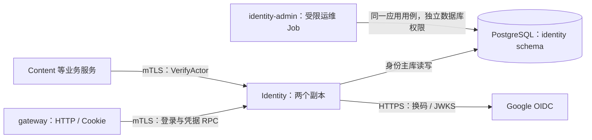
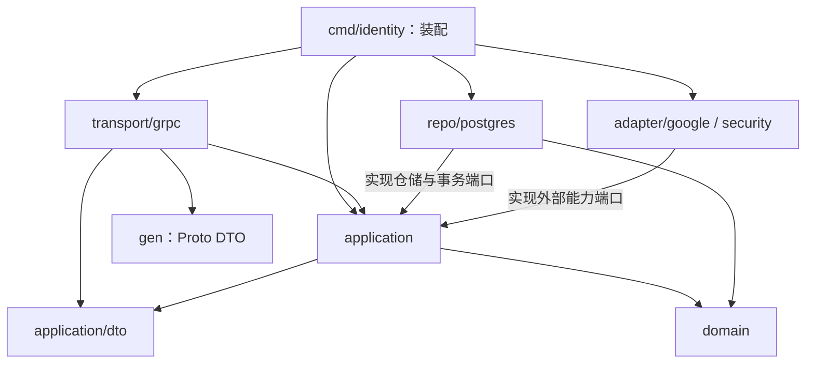

# Identity 身份服务设计

| 项目 | 内容 |
| --- | --- |
| 版本 | v0.5 · 2026-09-29 · Identity 分层重构落地 |
| 人类要求 | 先设计再按顺序实现 Identity；Google 登录参考本机 sub2api，入口使用 worth.oopsbox.cn；本次要求按包含 DTO、repo、domain 等职责的架构重构 Identity，并合回主工作区 |
| 依据 | [PRD](prd.md) 的 S2～S5、[H3 Google 登录](prd.md#google-login)、[七服务架构](backend-architecture.md)、[OpenAPI](../openapi.yaml) |
| 技术方案归属 | 本文的字段、期限、存储、RPC 补全与基座组织属于 Agent Self-Claimed |
| 当前状态 | Go 实现、9 个 RPC、SQL 迁移和真实 PostgreSQL 测试已完成；公网经私有 TLS 隧道连接本机 kind lab 的双副本 gateway/Identity；第 10 节分层已在本地实现；本次重构尚未发布到公网 |

**Identity 回答三个问题：你是谁、你的凭据是否仍有效、你以什么身份调用哪个接口。** 是否能修改某件作品、投某个任务，仍由对应业务服务判断。

阅读顺序：先看核心对象和功能流程；准备写代码时再看接口、[platform 清单](#platform)与验收。本文是身份模块设计依据，RPC 契约源为 [identity.proto](../backend/proto/humanworth/identity/v1/identity.proto)；其余服务设计见[架构划分](backend-architecture.md)，部署统一见[部署与实验计划](deployment.md)。

模块内部的目标目录、DTO 转换、领域行为、仓储接口、事务边界与迁移顺序见[分层架构设计](#layered-architecture)。前九节描述业务契约及已有实现；第十节记录本次分层如何承接这些行为。

## 1. 边界：哪些归 Identity

| 归属 | 负责什么 |
| --- | --- |
| Identity | Google 登录验证、稳定账号、网站会话、MCP 凭据、账号状态和角色、内部身份断言、自己的原始审计 |
| gateway | 解析 HTTP、过滤重复或冲突凭据、设置 Cookie、浏览器跳转、传递可信来源信息、把 RPC 错误映射成 HTTP |
| 各业务服务 | 自己的数据权限和规则；例如 Content 判定作品能否访问，Voting 保存账号×任务的永久禁投资格 |
| Moderation | 跨服务审计查询投影；Identity 只保存自己的原始审计 |
| platform | 各进程复用的配置、通信、数据库连接、日志和启停代码；它没有自己的业务进程或账号表 |

Google 客户端 Secret 仅给 Identity。gateway 不向业务服务转发原始 Cookie、Google token 或 MCP token，只携带短期身份断言。账号 ID 不因重新登录、换 token、改邮箱或进程重启而改变；Identity 不读写 Voting 的资格记录。

## 2. 核心对象

### 2.1 要持久化的对象

所有表位于 Identity 自己的 PostgreSQL schema，其他服务通过 RPC 使用它们。跨对象原子操作在这个 schema 内完成。

| 对象 | 主要字段 | 关键约束 |
| --- | --- | --- |
| **Account 账号** | `account_id`、`display_name`、`role`、`state`、`auth_version`、创建/更新时间 | ID 永久稳定；角色只有 USER/ADMIN；状态 ACTIVE/DISABLED；首次 Google 登录只建普通账号 |
| **ExternalIdentity 外部身份** | `issuer`、`subject`、`account_id`、可选邮箱及验证标记、更新时间 | `UNIQUE(issuer, subject)`；Google 的 `sub` 原样、区分大小写；邮箱仅为资料，不作为关联键 |
| **GoogleLoginTransaction 登录流程** | `flow_id`、流程 Cookie 摘要、`state_hash`、`nonce_hash`、加密的 PKCE verifier、OAuth 配置版本、固定回调 URI、状态、`exchange_attempt_id`、到期时间 | 十分钟有效；同一流程最多一次换码；所有副本共享；终态不能重新开放 |
| **LoginFamily 浏览器流程族** | `family_id`、创建时间 | 同一个旧流程 Cookie 并发发起时锁定同一 family，取消旧 pending/exchanging，避免双副本各保留一份旧流程 |
| **CredentialRecord 凭据** | `credential_id`、`account_id`、`kind`、`token_hash`、签发时 `auth_version`、状态、创建/到期/撤销时间 | WEB_SESSION 与 MCP_READ 分开；摘要唯一；明文随机凭据不落库；所有校验读取权威主库 |
| **WebSession 会话附属数据** | `credential_id`、加密的 `csrf_token`、加密密钥版本 | 与 WEB_SESSION 一对一；同一会话重复获取 CSRF token 不会让其他标签页失效 |
| **McpTokenMetadata 凭据附属数据** | `credential_id`、用户填写的名称、`create_request_id` | 与 MCP_READ 一对一；名称不影响权限；`(account_id, create_request_id)` 唯一，供响应丢失后查回记录 |
| **IdentityAudit / Outbox** | 事件 ID、动作、可信操作者、目标 ID、结果、原因、时间、账号版本 | 关键成功变更与审计/待投递事件同事务；不记录凭据、Google 授权码、完整资料或投票统计 |

`WebSession`、`McpTokenMetadata` 是说明不同凭据特有字段的逻辑对象，首版可放在凭据表的受约束列中，不强制多建两张表。Account、ExternalIdentity 与 CredentialRecord 的关联可使用 schema 内外键。

### 2.2 只在调用中使用的对象

| 对象 | 用途 |
| --- | --- |
| **Principal 已验证主体** | `account_id`、角色、`client_kind`、凭据 ID、账号身份版本；普通业务代码使用它，不重新解析 Cookie |
| **ActorAssertion 身份断言** | Identity 签发的不透明字符串；绑定主体、凭据、接收服务、完整 RPC 方法名、用途、签发时间和过期时间 |
| **ServicePrincipal 服务身份** | 从 mTLS 客户端证书取得的 gateway/content 等身份；不能从请求体、任意 Header 或 Pod 名称取得 |
| **GoogleOAuthConfig** | Client ID、Secret 文件引用、预注册回调 URI、允许的网站 Origin、配置版本；来自受控部署配置 |

匿名 Principal 不包含账号或角色，服务主体不能冒充某个用户。账号角色与凭据用途同时生效：管理员的 MCP token 仍然只能用于允许的读取与显式统计访问。

### 2.3 状态与首版参数

| 对象 | 状态变化 | 规则 |
| --- | --- | --- |
| 账号 | ACTIVE ↔ DISABLED；USER ↔ ADMIN | 状态或角色变化时递增 `auth_version`；旧凭据因此失效，恢复账号后也需重新登录 |
| 凭据 | ACTIVE → REVOKED / EXPIRED | 不恢复旧凭据；到期直接按时间拒绝，不等待清理任务 |
| 登录流程 | PENDING → EXCHANGING → SUCCEEDED / FAILED / EXPIRED | 先持久占用，再向 Google 换码；换码失败或结果未知后重新发起 |
| 登录取消/替换 | PENDING → CANCELLED；EXCHANGING → CANCELLED | 合法取消，或该浏览器重新发起并使旧流程失效；旧执行者提交时须重新检查状态 |

首版建议网站会话绝对有效期 **24 小时**、MCP token **30 天**、内部断言 **30 秒**；不做滑动续期或网站 refresh token。登录流程十分钟沿用已有契约，其余期限是可调整的技术默认值。允许小幅时钟误差不延长数据库中会话的有效期；凭据与流程的到期判断使用主库时间。

## 3. 核心功能逻辑

### 3.1 发起 Google 登录

1. 浏览器顶层导航到 `GET /api/auth/google`。gateway 拒绝 Bearer 凭据，调用 `StartGoogleLogin`；已有过期网站会话不阻止重新登录。
2. Identity 检查当前 OAuth 配置，生成独立的随机流程 Cookie、state、nonce 和 PKCE verifier。随机量至少使用 `crypto/rand` 生成 32 字节，PKCE 使用 S256。
3. 在本地事务中保存流程及固定配置版本；请求带有效旧流程 Cookie 时使旧未完成流程失效。并发替换使用行锁和状态条件，旧 EXCHANGING 执行者不能继续提交成功。
4. gateway 设置 `__Host-human-worth-oauth`，使用 `Secure; HttpOnly; SameSite=Lax; Path=/`、十分钟期限且不设置 Domain，302 跳转 Google。只申请 `openid email profile`。

回调 URI 来自部署配置，不能由请求的 Host、redirect_uri 或 returnTo 任意指定。Secret、PKCE verifier 不进入浏览器；state、nonce 是独立随机值，不嵌入账号、角色或敏感资料。

### 3.2 回调、建号与建立会话

| 步骤 | 操作 | 一致性边界 |
| --- | --- | --- |
| A. 解析 | 必须恰有一个 state，以及 code/error 中恰好一个；重复参数拒绝；未知附加参数忽略 | gateway 保留参数出现次数，不能先取第一个值掩盖冲突 |
| B. 占用 | 校验流程 Cookie、state、期限和状态；code 分支原子改为 EXCHANGING，记录随机 attempt ID | 条件更新成功才允许换码；两个副本同时处理时只有一个成功 |
| C. 验证 Google | 在数据库事务外换码；验证 ID token 的签名、允许算法、issuer、aud、exp、nonce 和适用的 azp | 只用固定 Google discovery/JWKS 来源；token 中的地址不参与取钥；换码不自动重试 |
| D. 本地提交 | 再校验流程仍属本 attempt 且未取消/过期；找回或创建账号、写入外部关联、新会话和 CSRF token、撤销当前浏览器旧会话、写审计并将流程置 SUCCEEDED | 一个本地事务提交；失败不能留下已成功账号关联却未完成的半次登录状态 |
| E. 返回浏览器 | 设置新网站 Cookie，以另一条独立 Set-Cookie 清流程 Cookie，303 返回 `/`；前端读取 `/api/me` | 多条 Set-Cookie 分开发送；不把 Google token 或网站会话明文放进 URL、JSON、localStorage |

Google 两种允许的 issuer 写法在完整验证后规范为 `https://accounts.google.com`，以 `(issuer, sub)` 查账号。首次登录按 issuer/sub 获取事务级 advisory lock，再查关联与建号；唯一键作为最终约束。锁冲突或数据库失败明确报错，不自动重做 Google 换码。账号与关联在同一事务创建，不留下孤立重复账号。稳定关联及 issuer/sub 规则依据 [Google OIDC](https://developers.google.com/identity/openid-connect/openid-connect)。

已有账号需锁定并重新检查状态和版本；禁用期间不能靠新登录创建替代账号。邮箱和显示名变动只更新资料，不更新关联，不授予管理员。没有显示名时使用普通默认名称，不把邮箱作为公开显示名。

`error=access_denied` 也必须先通过流程 Cookie/state 校验，且流程仍为 PENDING，才置 CANCELLED 并返回 `/?login=cancelled`；其他供应方错误转为脱敏错误。失败或取消不主动撤销旧网站会话。若 D 已提交但响应丢失，新的会话轮换已生效；再次登录仍找回同一账号，不声称旧会话一定有效。

### 3.3 网站请求认证与内部鉴权

1. **gateway 按服务端路由表选用途。** 决定是否允许匿名、目标服务和 RPC 方法。用户不能自己提交 audience、角色或 `allow_anonymous`。同时带网站会话与 Bearer 返回 400；无效凭据返回 401，不降级匿名。
2. **Identity.ResolvePrincipal 校验凭据。** 查询主库中的凭据和账号：类型、到期、撤销、账号状态、签发版本都要通过。网站写请求再验证 CSRF token 和精确 Origin；二者缺失或不符返回 403。受信代理只转交经过明确规则处理的来源信息，客户端伪造 Forwarded Header 无效。
3. **Identity 签发 ActorAssertion。** 首版采用成熟 JWS 库、固定 HS256 和 `kid`；签名密钥只在 Identity 副本之间共享。内容含账号/凭据/版本、issuer、audience、完整 RPC 方法、client_kind、签发/到期时间；明确要求这些字段存在，拒绝未知 key ID 和算法。它不进入客户端、日志或事件。
4. **业务服务验证两种身份。** mTLS 确认调用服务获准调用该方法；再用 `VerifyActor` 验证断言。audience 从调用 VerifyActor 的证书身份取得，RPC 方法由服务端拦截器取得，随后检查签名、期限、用途及主库中的当前账号/凭据状态。首版不缓存“允许”结果。
5. **业务服务执行自己的规则。** 例如 Voting 检查永久禁投资格，Moderation 检查管理员；身份认证成功不等于业务操作自动获准。

匿名只在没有凭据且路由明确允许时成立：签发绑定公开读取方法的匿名断言，VerifyActor 验证签名、服务和方法，不查询不存在的账号/凭据；匿名断言不能用于网站写入或管理。登录主体的账号与凭据则在同一主库查询快照内核对，断言中的账号、kind 和版本必须与记录一致。

Identity 的认证 RPC 使用服务身份白名单，不能安装一个会递归调用自身 `VerifyActor` 的通用拦截器。`GetCurrentSession`、`LogoutCurrentSession` 在 Identity 内复用本地验证函数。断言不是一次性业务命令：写请求的防重复仍归业务幂等协议。

服务调用内部协作方法时使用该方法明确允许的服务身份，不把用户 account_id 参数当作授权证明。需要再次按用户授权的跨服务调用，必须设计受限断言委托契约；首版不允许直接把只面向 Content 的断言转发给 Asset，也不开放任意重新签发权限。

**撤销的保证范围**：撤销提交后开始的新认证会拒绝旧凭据；已经通过校验的在途业务请求可能完成。不能用“断言只活 30 秒”声称可以取消所有在途操作，尤其不能以此替代 Voting 自己的事务规则。

### 3.4 当前会话、CSRF 与退出

- `GET /api/me` 只接受网站会话，返回已有 Session schema 中的账号资料、角色和当前会话 CSRF token；响应 `no-store`。GET 不改变任务投票资格。
- CSRF token 每会话生成并加密保存，`/api/me` 可重复读取；网站写入要求 `X-CSRF-Token` 与允许的 Origin 同时通过。SameSite 是补充约束。依据 [OWASP CSRF](https://cheatsheetseries.owasp.org/cheatsheets/Cross-Site_Request_Forgery_Prevention_Cheat_Sheet.html)。
- `POST /api/auth/logout` 验证网站会话、CSRF 与来源后，在事务中撤销当前凭据并记审计；提交成功才清 Cookie。重试遇到已撤销会话仍按当前 OpenAPI 返回 401。
- 退出只影响当前网站会话。其他设备、MCP token、Google 账号和任务投票资格保持各自状态；没有前端通过 GET 或仅删除 Cookie 就宣告服务端退出的路径。

### 3.5 MCP 凭据生命周期

既有契约要求 MCP token 属于用户本人。以下生命周期已经实现，对应 HTTP 与 RPC 同步记录在 OpenAPI 和 Proto：

| 操作 | 核心逻辑 |
| --- | --- |
| 创建 | 仅已登录网站用户，验证 CSRF/Origin；账号来自 Principal；生成 32 字节随机 token，事务内存摘要和元信息；明文只在首次成功响应返回 |
| 列表 | 只查本人；返回凭据 ID、名称、创建/到期/撤销状态和创建请求 ID，不返回明文或摘要 |
| 撤销 | 只撤销本人凭据；MCP token 自己不能调用管理接口；同一撤销目标重复操作稳定返回已撤销结果 |
| 轮换 | 创建新 token，用户更新客户端后显式撤销旧 token；两者始终绑定同一个账号，资格不会重新建立 |
| 响应丢失 | 按 `create_request_id` 查回元信息；无法再次显示明文时撤销该凭据后重新创建；重试同一个 request ID 不生成第二个凭据 |

MCP 工具只开放 `list_tasks`、`get_task`、`view_task_statistics`。最后一个必须显式确认，并由 Voting 先落永久禁投记录再返回统计；“内容读取 token”不代表这个操作无副作用。HTTP 中允许 MCP 的辅助读取不自动成为 MCP 工具。Google access token、网站会话和 MCP token 不能相互替代；这里也不把个人 token 方案宣称为已经实现完整 MCP OAuth 授权服务器。

### 3.6 角色与账号状态管理

首次登录不授予管理员，Google 邮箱域名也不授予管理员。实验阶段用受限运维 Job 调用 Identity 自己的管理用例，输入已存在的账号 ID、目标状态/角色和预期 `auth_version`，审计记录目标角色与状态；操作者来自运维身份。Job 使用 Identity 的代码和专用权限，不给其他业务服务写账号表的入口。

管理用例锁定账号、检查预期版本，更新状态/角色并递增 `auth_version`，同事务记录审计。凭据保存的签发版本与新版本不符时全部失效；账号恢复后不复活旧凭据。并发签发凭据也要锁定同一账号并读取当前版本。首次管理员需要人工指定已验证账号；测试只操作合成账号，不自动授予真实用户管理员。面向网站的账号管理 UI/API 后续另行设计。

## 4. 多副本下怎样保证正确

Identity 沿用同一套 lab 配置：两个 Pod，连接同一 PostgreSQL 主端点。节点变化不会改变用户账号或会话。

| 情况 | 处理规则 |
| --- | --- |
| 发起登录在副本 A，回调落到 B | 流程、verifier、会话都在共享主库，配置/解密密钥版本对齐；无需粘滞会话 |
| 两份相同回调同时到达 | `PENDING → EXCHANGING` 条件更新仅一份成功；另一个返回流程无效，不能二次换码 |
| 换码时进程崩溃 | 记录仍为 EXCHANGING，到期后失效；重新发起登录，不跨进程接着重放授权码 |
| 已占用流程被替换或到期 | 最终提交重新核对状态、期限、attempt ID；迟到结果不得建立会话 |
| 两个有效登录同时首次建号 | 外部身份唯一键和整体事务保证一个稳定账号；两个不同设备可以各自得到独立会话 |
| 数据库提交超时 | 结果可能未知；按 flow/request ID 确认持久结果，不假定回滚；凭据只存摘要，不能重新返回旧会话明文，必要时重新登录；不重复外部换码 |
| 主库/Identity 不可用 | 返回 503；不使用过期缓存认证、不按匿名放行；已有公网健康检查不能替代此验证 |
| Google 暂时不可用 | 新登录失败，已有本地会话仍可验证；不把 Google 可达性设成整个服务的存活探针 |
| 密钥轮换或滚动发布 | 两副本先同时具备新旧 key ID，再切换新签发；旧解密/验签 key 保留到对应数据失效或重加密完成 |

涉及同一事务中的多个账号（例如切换账号并撤销旧会话），按账号 ID 排序加锁，再锁定本次相关凭据；登录 family 和流程行在账号锁之前锁定。审计与 outbox 最后追加。所有外部 HTTP/RPC 都在数据库事务之外；当前事务错误直接返回，不自动重试 OAuth 或写 RPC。

凭据摘要使用高熵随机 token 的 SHA-256；PKCE verifier 和 CSRF 值使用标准 AEAD 加密并绑定记录 ID/字段用途，密钥来自 Secret 文件。不要自写 OAuth/JWT/JWKS 验证器；已采用 `golang.org/x/oauth2`、`coreos/go-oidc/v3` 与 `golang-jwt/jwt/v5`，版本见 [go.mod](../backend/go.mod)，并覆盖 Google issuer 兼容行为。库完成签名等通用校验后，Identity 仍显式检查 nonce 和适用的 azp，不能假定库替代业务绑定。内存中的 Google token 用后释放，不存储 refresh token。

流程进入终态时清除加密 verifier；过期流程和凭据按小批次清理，多个副本的清理动作必须可重复执行。到期拒绝在请求校验中完成，清理延迟不会延长有效期。审计与账号关联按独立保留策略保存，不随会话过期删除账号。

## 5. 接口边界与 Proto 落地范围

### 已实现的九个 RPC

| RPC | 调用方 | 输入 / 输出重点 | 对外入口 |
| --- | --- | --- | --- |
| `StartGoogleLogin` | gateway 服务身份 | 可选旧流程 Cookie → 授权 URL、流程 Cookie、期限 | `GET /api/auth/google` |
| `CompleteGoogleLogin` | gateway 服务身份 | 流程 Cookie、state、code/error oneof、可选旧网站 Cookie → 固定回跳路径、可选新会话 Cookie | `GET /api/auth/google/callback` |
| `ResolvePrincipal` | gateway 服务身份 | 网站凭据或 MCP token oneof、服务端路由用途 → Principal＋ActorAssertion | 内部 |
| `VerifyActor` | 白名单业务服务 | ActorAssertion＋服务端 RPC 方法 → 当前有效 Principal | 内部 |
| `GetCurrentSession` | gateway，网站本人 | 已验证网站主体 → 账号、角色、CSRF token | `GET /api/me` |
| `LogoutCurrentSession` | gateway，网站本人 | 已验证主体及写入用途 → Empty | `POST /api/auth/logout` |

敏感登录返回值只供 gateway 设置 Cookie，不能自动用 ProtoJSON 透传。内部方法默认拒绝未列明的服务身份；健康检查独立配置访问规则。

管理概览由未来的 gateway 聚合；`ListAuditEvents`、`IngestAuditEvent` 属于 Moderation 的审计投影，不放入 IdentityService。上述六个方法和下面三个 MCP 生命周期方法均已生成 Go 接口并实现。

MCP 管理已补 `CreateMcpToken(name, create_request_id)`、`ListMyMcpTokens(cursor)`、`RevokeMcpToken(credential_id)`，都以网站 Principal 决定所有者；列表返回元信息，创建额外返回一次明文。账号运维暂用本模块 Job 用例，不新增公开 RPC。公开入口为 `POST/GET /api/me/mcp-tokens` 与 `DELETE /api/me/mcp-tokens/{credentialId}`；MCP 工具本身仍待 Content/Voting 等模块实现。

Content 的 `ListMySubmissions` 已加入 audience/method 策略，规则与私有详情一致：仅网站会话可取得绑定 `content` audience 和该完整 RPC 方法的 ActorAssertion；MCP token、匿名主体、错误 audience/method 均拒绝。Content 收到后仍调用 `VerifyActor` 复核当前凭据，管理员角色不会改变“我的”作者账号。该接入不新增 Identity Proto 字段，也不允许 Content 查询 Identity 表。

错误延续既有映射：格式/流程问题 400，凭据无效 401，来源/CSRF/用途/角色禁止 403，依赖不可用 503。未知账号与无效凭据不返回可枚举的资料；错误只包含稳定原因和 request ID，不包含 Google 原始响应体。回调所有响应使用 no-store/no-referrer。

<a id="platform"></a>
## 6. 为 Identity 实现哪些 platform 公共基座

**先实现能支撑 Identity 和 gateway 的公共能力，再随第二个业务服务提取真正重复的代码。** 已在 [platform](../backend/internal/platform) 实现下表所需公共能力，既有 Node.js/Python 基座与部署保护继续保留。

### 6.1 第一批：运行 Identity 必需

| 能力 | 最小实现 | 放在哪里 / 完成判据 |
| --- | --- | --- |
| **配置与密钥加载** | 类型化配置；环境变量与只读 Secret 文件；必填、地址、期限和配置版本校验；错误不带密钥 | platform 提供加载工具；Google 字段属于 Identity。缺配置明确失败，双副本读取一致版本 |
| **服务生命周期** | `context`、系统信号、启动/就绪/存活检查、gRPC graceful stop、关闭连接池、限时退出；内部健康入口供探针使用 | platform 管启停；schema/key 不就绪不接业务；SIGTERM 停接新请求后处理在途工作；健康入口不开放业务方法 |
| **gRPC 通信** | 服务端/客户端初始化、mTLS、证书服务身份、deadline、panic 转内部错误、消息大小限制；K8s DNS 与 round_robin | platform 提供机制，各模块登记允许调用者；错误证书、伪造身份被拒；合法调用能落到两个副本 |
| **数据库连接与迁移执行** | `pgxpool` 连接主端点、连接上限、context 超时、事务回滚；迁移独立 Job、版本表与锁 | platform 复用连接与迁移机制；Identity 拥有 SQL、表与事务。两个 Pod 不竞相修改 schema，滚动版本兼容 |
| **请求上下文与错误** | request ID、trace context、已验证 ServicePrincipal/Principal 的 context 存取；gRPC code＋稳定 reason | 不把调用者自报账号当主体；gateway 单独维护 HTTP 映射；Identity 自己执行账号/凭据策略 |
| **日志和基本遥测** | `log/slog` JSON、OpenTelemetry 的 trace/指标接入；记录方法、耗时、错误率、连接池；敏感字段白名单 | 已有 gateway→Identity→数据库查询/Google 换码 span、JSON 日志、Prometheus 指标；OTLP 接收端尚未部署，不采集 SQL 参数、Cookie、token、回调 query |
| **入口资源保护** | 有界请求大小、并发和超时；登录入口基础限流；Google HTTP 客户端复用连接并限制响应大小 | 先做进程级保护并明确双副本会扩大总限额，不能宣称全局限流；超限及时拒绝，无无限排队/重试 |

目录可采用 `backend/internal/platform/`，用小包承载已经被多个入口使用的机制；业务代码在 `backend/internal/identity/`，HTTP/Cookie 适配在 gateway。对应目录均已有真实调用方；schema 迁移执行仍留在 Identity，等第二个模块需要时再提取。

建议初始内部普通 RPC 总期限 2 秒、Google 登录回调总期限 15 秒，Google 换码最多占用其中 10 秒；子调用始终受父 deadline 限制。每个 Identity 副本连接池先设上限 4，双副本共 8，滚动增加一份时为 12，迁移连接另算；这些是实验起点，后续按观测调整。

### 6.2 同步需要的工程支撑

| 项目 | Identity 阶段做到什么 |
| --- | --- |
| Go/Proto 构建 | 建一个 Go module，锁定 Go、Buf 编译器、生成插件及依赖版本；生成代码检查、格式检查、`go test`、`go test -race` 接入 CI |
| 真实数据库测试 | 临时 PostgreSQL 与隔离 schema；验证唯一约束、事务回滚、双进程竞争、撤销和失效；不能只用内存仓库替代 |
| HTTP 与 Google 联调 | 测试 OIDC 供应方覆盖签名/JWKS、issuer/aud/nonce、PKCE、超时和重放；再用真实 Google 测试账号走浏览器回调 |
| lab 部署 | 独立镜像、两个 Pod、服务证书、Secret 挂载、主库连接、readiness、允许的网络调用；Identity 的 Google HTTPS 出口单独放行 |
| 认证入口 | 正式 HTTPS 域名、预注册 callback；开发代理仍走公网，但本地 HTTPS 浏览器入口、允许 Origin、回调与 Cookie 必须成套匹配 |

同一 Google 客户端可以有允许的多环境回调，但只能从服务器配置选择。当前 Start RPC 没有环境选择字段：第一次联调先固定一个入口；需要同时支持本地与正式浏览器入口时，先给可信 gateway→Identity 契约补充受限的配置选择机制，不让浏览器任意指定 callback，也不靠不可信 Host 切换身份环境。

### 6.3 第二批：接入其他模块时再实现

- **Outbox 投递 / Inbox 去重**：Identity 先在本地事务保存审计和 outbox；Moderation 接入时实现投递与查询投影。登录正确性不依赖事件到达或异步撤销缓存。
- **统一鉴权接入代码**：第一份业务服务接入时复用 mTLS 调用者检查、VerifyActor 客户端和上下文存取；各服务的权限规则留在本模块。
- **必要的跨服务用户委托**：具体调用链确有需要时定义原接收服务、目标服务、方法与用途限制，再增加委托 RPC；不以共享签名密钥替代边界设计。

Google 换码、账号关联、会话/CSRF、MCP 用途与角色变更都是 Identity 业务逻辑，不抽成通用 platform 登录框架。Redis、消息队列、服务网格、通用 Repository、插件系统和动态配置中心不属于第一批依赖。

<a id="sub2api-reference"></a>
## 7. sub2api 参考与后续 Google 配置

用户指定的源码位于 `/home/oops/services/sub2api`，本机版本文件为 **0.1.155**。本次检视的工作副本没有可解析 HEAD，因此按文件 SHA-256 记录来源，详见[参考记录](references.md#identity-design)。没有直接复制代码或引入该项目的业务依赖。

| 参考位置 | 学习内容 | Human Worth 的适配 |
| --- | --- | --- |
| `backend/internal/handler/auth_email_oauth.go` | Google start/callback、十分钟 state Cookie、服务端换码、配置读取与错误分流 | gateway 只处理 HTTP；换码与身份确认集中到 Identity；增加共享一次性流程、PKCE 和 ID token 验证 |
| `backend/internal/service/auth_email_oauth_auto.go` | 外部身份查询、账号状态检查、建号与凭据签发 | 仅按 issuer/sub 找回账号；不采用邮箱自动关联、密码注册、邀请或赠送额度流程 |
| `backend/internal/service/setting_oauth.go` | 配置默认值与存储设置合并、必要参数校验 | 首版用部署配置和 Secret 文件；不依赖另一套应用数据库实时读取配置 |
| `backend/internal/handler/auth_email_oauth_test.go` | 已有账号登录、首次注册及回调结果的测试组织 | 改为验证稳定账号、HttpOnly 会话、多副本回放与撤销；源码阅读不等于测试已运行 |

源码中的 Google 路径使用 access token 请求 UserInfo，并将平台 access/refresh token 放入前端跳转 fragment；Human Worth 沿用已定的 OIDC 校验与服务端会话契约。该差异也使平台无需复制 sub2api 的前端 token 持久化逻辑。

sub2api 的 Google 登录设置名是 `google_oauth_client_id`、`google_oauth_client_secret`、`google_oauth_redirect_url`；配置组 `google_oauth` 提供基础值。用户后续明确本轮只学习登录逻辑和实现，密钥另行提供；本设计不依赖取得现有密钥。

Human Worth 实现时使用 `GOOGLE_OAUTH_CLIENT_ID`、`GOOGLE_OAUTH_CLIENT_SECRET_FILE`、`GOOGLE_OAUTH_REDIRECT_URI` 等配置，Secret 只读挂载到 Identity。需要的是 Web OAuth 客户端凭据；Google/Gemini API key 或服务账号私钥不能代替网页登录 Client Secret。即使复用已有客户端，也须为 Human Worth 登记精确回调并核实授权配置；本轮未修改 sub2api 或 Google 控制台；已将用户提供的 Web 客户端凭据保存到仓库外私有文件，并通过 Secret 挂载到 lab Identity。

## 8. 实施顺序与验收

1. **定 Identity Proto 与表迁移**：按九个 RPC 编写接口，校对数据唯一键、敏感返回值和 gateway 映射。
2. **做第一批 platform 与最小入口**：能启动、健康检查、mTLS 通信、连接主库、记录脱敏日志；保留现有 Node.js 公网服务。
3. **做 Google 登录闭环**：先写状态/并发测试，再实现发起、回调、会话和退出；随后验证真实 Google 浏览器登录。
4. **补角色变更与 MCP 生命周期**：完成对应管理契约、版本失效、用途校验与本地审计。
5. **双副本验收**：请求交替落到不同副本，验证下表；再接 Content，实现第一条真实业务鉴权链路。

| 验收目标 | 必须观察到的结果 |
| --- | --- |
| 首次 / 再次登录 | 首次一份普通账号；再次及邮箱变化仍是同一 ID；并发首次登录无重复账号 |
| Google 验证边界 | 错误签名、issuer/aud/nonce/verifier、过期 token、伪造或重复 state、取消分支缺绑定全部被拒 |
| 双副本与失败恢复 | 跨副本回调成功；重复回调只一次换码；崩溃/替换/过期后的迟到结果无效；提交丢响应不造成重建账号 |
| 会话与 CSRF | 安全 Cookie、独立 Set-Cookie、旧会话轮换；缺 CSRF/错误 Origin 拒绝，GET 不退出；多标签页读取 CSRF 不互相失效 |
| 撤销、角色与账号 | 撤销/禁用/角色变更提交后，新认证拒绝旧版本；重新启用不复活旧 token；并发签发与管理变更顺序明确 |
| 服务调用 | 无证书/错误服务/错误 audience 或方法/伪造角色被拒；Identity 认证链不递归；合法调用成功 |
| MCP 用途与稳定资格 | 同账号网站与 MCP 主体一致；MCP 不能写入/管理；显式统计永久禁投，换 token 后仍不可投；此项须与 Voting 集成验证 |
| 密钥与观测 | 两副本密钥轮换兼容；日志、trace、错误、镜像及 Git 不包含真实凭据；新登录失败不拖垮已有会话认证 |
| 部署与依赖故障 | Pod 切换会话保留；主库故障不降级放行；Google 断连只影响新登录；真实 HTTPS 代理链保持 Cookie/Origin/callback 一致 |

上表是完整验收要求，实际证据分层记录在下文；模拟供应方测试和 Pod 就绪不能替代真实 Google 用户登录，也不能证明尚未实现的 Voting 资格规则。

历史记录（2026-09-18，仅文档）：`python3 scripts/check_docs.py`、`git diff --check` 退出码均为 0；六个 RPC 的职责与 HTTP/内部入口已核对，sub2api 参考文件指纹可复核。文档整理后接口设计保留在本文，独立 Proto 尚待编写；未运行 Google 登录或新增软件测试。


## 9. 实现与验证入口

- [Go 工程说明](../backend/README.md)：生成 Proto、检查与本地测试命令。
- [登录与账号代码](../backend/internal/identity)、[HTTP 适配](../backend/internal/gateway)、[迁移 SQL](../backend/internal/identity/repo/postgres/migrations/001_identity.sql)。
- [lab 安装与故障验证](deployment.md#identity-lab)：真实双副本、数据库、网络权限和运维 Job。

实现固定网站会话 24 小时、MCP token 30 天、ActorAssertion 30 秒、登录流程 10 分钟。单 gateway 每分钟允许 60 次登录发起；两副本合计上限随副本数变化，不是全局或每用户配额。普通 RPC 总期限 2 秒，回调 15 秒，Google HTTP 10 秒；单进程最多 64 个在途业务请求。每 Identity 连接池最多 4 条连接，滚动期间 3 份合计最多 12 条。

过期 web 会话保留 7 天后清理；MCP 元信息与撤销记录保留以维持创建请求 ID 的防重语义。审计先保存在本模块的 outbox 表，尚未向 Moderation 投递。其余模块在路由策略表中的 RPC 名称是待对应模块定稿的权限用例，不表示这些业务接口已经实现。

2026-09-19：`go vet ./...`、`go test -race -tags=integration ./... -count=1 -timeout=120s` 通过。测试使用隔离 PostgreSQL、两个真实 mTLS gRPC 服务器、两个 HTTPS gateway，以及测试专用 OIDC HTTP/JWKS 供应方；覆盖并发首次登录、回调占用/替换/迟到、签名与 nonce/PKCE、CSRF、撤销、权限版本、MCP 防重、受限迁移/运行账号、密钥重叠及数据库断连拒绝。生产程序没有切换到测试供应方的配置开关。

用户提供的 Google 凭据已配置，接口已从受保护 dev 发布，用户于 2026-09-19 确认“登录成功，能看到账号”。当前入口固定为 `https://worth.oopsbox.cn`；本地 HTTP 开发代理可以读取公网 API，但不能声称支持该域名 Cookie 的本地登录。需要完整本地登录时再登记一套可信 HTTPS 回调与 Origin 配置。

<a id="layered-architecture"></a>
## 10. Identity 分层架构与实现（2026-09-29）

### 10.1 目标、依据与交付边界

**Human Design**：用户先要求设计包含 DTO、repo、domain 等职责的标准分布式后端架构，随后明确要求按该架构重构 Identity 并合回主工作区；既有 Go、分布式学习目标及产品不变量继续有效。

**Agent Self-Claimed**：采用应用层编排、领域模型表达规则、仓储与外部适配器实现端口的分层方案。包名、接口位置、事务契约、迁移批次及验收方式均为本次技术选择。Go 没有强制的统一业务目录；这里给出本项目可落实、可检查的规范。

基线为 `origin/dev` 的 `d225da0739a3e9dcbf9fa36b1aa94a7afc52aafc`。重构前 `Server` 同时依赖 Proto、pgx、JWT 与业务规则；本次已拆分其九个 RPC，以及运维 `ChangeAccount`、后台 `Cleanup`。实现目录与第 10.3 节一致，根包只保留验收测试，不再提供旧 Server 外观。重构保持 HTTP/Proto、数据库 schema、凭据格式、部署入口和既有权限语义兼容；新增业务另行设计。

采用依据见[本次成熟参考](references.md#identity-layering)：借鉴 DDD 的业务与持久化分离、Go 的消费方接口惯例，以及 pgx/PostgreSQL 的本地事务和锁机制。框架无关的分层原则用于本项目；不引入 .NET、ORM、通用 CRUD 基类、依赖注入容器或消息总线。

### 10.2 运行拓扑与代码依赖

Identity 继续作为一个独立微服务部署两个副本。DTO、domain、repo 是进程内的代码职责，不单独部署，不通过网络互调。



下面的箭头表示 **Go import 依赖**，与运行时调用方向分开理解：



`domain` 仅依赖标准库；`application` 依赖领域类型、自己的 DTO 和端口，不 import pgx、gRPC、生成代码或具体适配器。`repo/postgres` 在运行时被应用层调用，但通过应用层接口接入。`cmd` 手工调用构造函数装配依赖；运维入口只装配账号管理用例和所需仓储。

配置也沿边界传递：应用层接收可信 Origin、有效期等用例参数；Google Client Secret、JWT/AEAD 密钥环只交给对应适配器。domain 不读取环境变量，application 不接收整个启动配置或原始密钥。

### 10.3 目标目录与职责

以下目录均已有对应实现；同一层按用例和对象拆文件，不为每个实体单独建立包。

```text
backend/
├── cmd/identity/main.go                 # 配置、依赖装配、gRPC、探针、清理调度
├── cmd/identity-admin/main.go           # 运维参数 → 账号管理用例
├── proto/humanworth/identity/v1/        # 已发布 RPC 契约源
├── gen/humanworth/identity/v1/          # 生成的协议 DTO / 服务接口
└── internal/identity/
    ├── transport/grpc/
    │   ├── server.go                   # 九个 RPC → 用例；响应映射
    │   ├── mapper.go                   # Proto ↔ 应用 DTO
    │   ├── authorization.go            # mTLS 调用方与 unary/stream 白名单
    │   ├── targets.go                  # 完整 RPC 名 ↔ 受众、业务操作
    │   └── errors.go                   # 内部错误 → 现有 gRPC code/reason
    ├── application/
    │   ├── service.go                  # 依赖、用例配置、构造函数
    │   ├── login.go                    # 发起、占用、外部换码、本地完成
    │   ├── auth.go                     # 解析主体、签发/复核断言
    │   ├── session.go                  # 当前会话、退出
    │   ├── mcp.go                      # 创建、列表、撤销
    │   ├── account.go                  # 受限账号管理用例
    │   ├── maintenance.go              # 清理批次编排
    │   ├── repo.go                     # 消费方仓储接口、事务接口、查询结果
    │   ├── ports.go                    # Google、秘密保护、断言签验接口
    │   ├── errors.go                   # 用例失败分类与稳定原因
    │   └── dto/                        # login/session/actor/mcp/account 输入输出
    ├── domain/
    │   ├── account.go                  # 账号、外部关联、角色/状态/版本规则
    │   ├── credential.go               # 会话/MCP 凭据的有效性与撤销规则
    │   ├── login.go                    # 登录流程族、流程及状态转换
    │   ├── principal.go                # 可信用户主体、凭据用途
    │   ├── policy.go                   # 业务操作的匿名/MCP/管理员/写入规则
    │   ├── audit.go                    # 审计事实的数据结构
    │   └── errors.go                   # 与协议无关的业务拒绝原因
    ├── repo/postgres/
    │   ├── store.go                    # Reader、WithinTx 与事务内仓储装配
    │   ├── account.go                  # accounts / external_identities SQL
    │   ├── credential.go               # 凭据 SQL、联合快照、列表查询
    │   ├── login.go                    # family / flow SQL、锁与条件更新
    │   ├── audit.go                    # 同事务审计追加
    │   ├── maintenance.go              # 有界清理 SQL
    │   ├── mapper.go                   # 私有数据库行 → 领域对象/查询结果
    │   ├── migrate.go                  # 已有迁移器与就绪检查
    │   └── migrations/                # 原 SQL 原样迁移，保留文件名和校验和
    └── adapter/
        ├── google/oauth.go            # 已有 OAuth2/OIDC 库与固定 Google 端点
        └── security/                  # JWT、AEAD、摘要、随机秘密、密钥环
```

| 职责 | 应当承担 | 边界 |
| --- | --- | --- |
| transport | 消息形状校验、提取可信服务身份、映射 DTO/错误、调用用例 | 不写 SQL，不作账号状态转换；HTTP Cookie/跳转继续由 gateway 处理 |
| application | 完成一个用例、校验调用用途、选择事务边界、组织领域规则和 I/O | 不实现 SQL、JWT 或 Google 协议；不直接修改实体私有状态 |
| domain | 表达对象行为与不变量，给出允许/拒绝及状态变化 | 不接收 Proto、HTTP Request、pgx.Tx、JWT 对象；不直接访问时钟或网络 |
| repo | 加载与保存状态、执行锁/唯一约束/条件更新、将 SQL 错误归一化 | 不签发凭据、不决定管理员策略；所有事务内方法复用同一连接 |
| adapter | 使用成熟库完成 Google 交互、签验、加解密及安全随机生成 | 验签成功不能代替数据库中的当前凭据复核 |
| cmd / platform | 依赖装配、Secret 加载、通信、日志、deadline、生命周期 | platform 不拥有 Identity 的业务模型或仓储接口 |

### 10.4 DTO、领域对象和数据库行分别建模

**协议 DTO** 继续使用生成的 `pb.*Request/Response`，gateway 的 HTTP JSON 契约继续独立映射。**应用 DTO** 使用普通 Go 类型描述用例输入/输出，放在 `application/dto`，不带 Proto、pgx、ORM 或 JSON 框架依赖。**领域对象** 有自己的类型和行为。**数据库行结构** 仅在 `repo/postgres` 内部使用，需要时定义，不为每张表机械复制全部字段。

| 现有入口 | 应用 DTO 示例 | 领域/仓储交互 |
| --- | --- | --- |
| `StartGoogleLogin` | `StartLoginInput` / `StartLoginResult` | 流程族、取消旧流程、新建 LoginFlow |
| `CompleteGoogleLogin` | `CompleteLoginInput` / `CompleteLoginResult` | LoginFlow、ExternalIdentity、Account、Web Credential |
| `ResolvePrincipal` | `ResolvePrincipalInput` / `ResolvePrincipalResult` | 凭据快照、Principal、操作策略、断言签发 |
| `VerifyActor` | `VerifyActorInput` / `PrincipalResult` | 断言签验、凭据快照、操作策略复核 |
| `GetCurrentSession` | `CurrentSessionInput` / `CurrentSessionResult` | 当前账号资料与该会话的 CSRF |
| `LogoutCurrentSession` | `LogoutInput` / 空结果 | 当前 web 凭据撤销与审计 |
| `CreateMcpToken` | `CreateMCPTokenInput` / `CreatedMCPToken` | 账号、web 凭据、创建请求 ID、新 MCP 凭据 |
| `ListMyMcpTokens` | `ListMCPTokensInput` / `MCPTokenPage` | 本人元数据查询与游标 |
| `RevokeMcpToken` | `RevokeMCPTokenInput` / 空结果 | 本人目标 MCP 凭据与审计 |
| `ChangeAccount`，仅 CLI | `ChangeAccountInput` / 空结果 | expected version、账号状态/角色变更与审计 |
| `Cleanup`，后台 | 配置中的批次限制 / 执行结果 | 过期流程、流程族与旧 web 凭据清理 |

转换只放在实际边界：`Proto → 应用 DTO → 领域行为`，数据库查询结果经仓储转换后进入应用层；返回时由应用层选择输出字段，再映射为 Proto。列表查询可以直接返回应用层定义的只读元数据投影，无需为每行创建完整聚合。

应用 DTO 保留现有 `oneof` 的互斥语义和字段存在性；显式凭据为空不能解释为匿名。账号 ID、角色不能由普通请求自报；唯一接受目标账号和新角色的输入属于独立运维用例。可信服务名由 transport 从 mTLS 上下文取得，操作人由受控 CLI 配置取得，均与客户端可编辑输入分开传递。

创建 MCP 的结果类型单独承载一次明文 token；列表结果类型没有该字段。原始会话、流程 Cookie、授权码和断言仅在必要的临时 DTO/端口参数内存在，不打印 DTO、不放进审计、不自动序列化为 HTTP。摘要和 CSRF/PKCE 密文经专门仓储参数持久化；领域对象不负责加密。

### 10.5 Domain 中的行为与一致性边界

| 领域对象/规则 | 已实现行为 | 必须保持的不变量 |
| --- | --- | --- |
| Account | `ChangeAccess(expectedVersion, role, state)` | 稳定 ID；普通用户初始角色；按预期版本修改并递增 auth_version，当前同值变更也保持既有递增行为 |
| ExternalKey | 以经过验证的 issuer/subject 定位 Account | 同一 issuer/subject 只能绑定一个账号；邮箱变化只更新资料，不自动合并 |
| Credential | `Validate(account, expectedKind, now)`、`Revoke(now)` | 未过期/未撤销、账号 active、版本相同、用途匹配；撤销后不能恢复 |
| LoginFlow | `Claim(attempt, now)`、`Cancel()`、`Complete(attempt, now)`、`Fail(attempt)` | 领取只允许 pending；完成只允许匹配 attempt 的 exchanging；过期/取消后的迟到结果不能完成 |
| LoginFamily | 表达同一浏览器发起替换的范围 | 取消该族所有 pending/exchanging 后再创建新流程，跨副本也遵循同一顺序 |
| Policy | `PolicyFor(operation)`、`Authorize(principal)` | 未知操作默认拒绝；管理员的 MCP 凭据仍受 MCP 白名单约束；写意图决定网站 Origin/CSRF 检查 |
| AuditEvent | 记录已发生的账号/凭据变化 | 仅持久化脱敏事实；与对应变更同事务提交 |

状态字段通过构造、仓储恢复函数和行为方法访问；恢复已有记录也检查结构合法性。`Account`、`Credential`、`LoginFlow` 分开加载，账号对象不内嵌全部历史会话/流程。跨对象的一致性通过 Identity 自有库的一个本地事务维护，不为追求“一个聚合一事务”而把旧会话撤销、新会话创建、流程完成及审计拆开。

领域行为接收 `now` 参数，测试可以传固定时间。生产中流程/凭据有效期以主库 `clock_timestamp()` 为准：正常认证一次联合查询取得账号、凭据与数据库时间；写操作在加锁后重新取当前数据库时间并校验，避免用事务开始前的时间放行已过期凭据。JWT 的时间校验继续交给现有库，使用受控进程时钟；两者不互相替代。

业务操作在 domain 使用语义标识，如 `CreateMCPToken`、`ReadOwnSubmission`；完整 RPC 路径和生成常量集中在 `transport/grpc/targets.go` 映射。映射同时给出 operation、audience、完整 method，签发与复核使用同一份映射并拒绝不匹配；不得用前缀匹配、通配符或客户端自报 operation 扩权。保留已存在的 Content 四个方法及未来方法的策略，未来策略不代表服务已经实现。

### 10.6 Repo 端口与事务控制

仓储接口定义在消费它们的 `application/repo.go`；具体实现放在 `repo/postgres`。domain 的纯规则不访问仓储，因此不用为了目录对称把仓储接口塞进 domain。接口按当前用例需要定义，没有 `BaseRepository[T]` 或通用 `Save(any)`。

核心端口如下；完整接口见 [application/repo.go](../backend/internal/identity/application/repo.go)：

```go
// application/repo.go
type Transactor interface {
    WithinTx(ctx context.Context, run func(TxRepos) error) error
}

type TxRepos struct {
    Accounts    AccountRepository
    LoginFlows  LoginRepository
    Credentials CredentialRepository
    Audit       AuditRepository
    Now         func(context.Context) (time.Time, error)
}

type IdentityReader interface {
    // 一条主库查询返回 Account、Credential 和该次查询的 DBNow。
    ReadCredential(ctx context.Context, key CredentialKey) (AuthSnapshot, error)
    ListMCP(ctx context.Context, q MCPQuery) ([]dto.MCPToken, error)
}
```

这些接口和查询结构只承载领域值或普通 Go 值，不能暴露 `pgx.Tx`、`pgx.Rows`。`TxRepos` 中四个仓储必须绑定同一个真实事务；回调结束后不能保存仓储引用继续使用。独立读取使用 `IdentityReader`，写用例的锁定读取和写入全部经回调中的仓储执行，禁止中途回到 pool 查询。

| 端口 | 当前需要的能力示例 | PostgreSQL 实现义务 |
| --- | --- | --- |
| AccountRepository | 按外部标识找账号、`LockExternalIdentity`、按 ID 顺序 `LockAccounts`、创建关联、保存账号访问状态 | issuer/subject 事务 advisory lock；唯一键；账号行锁与 expected version 条件 |
| LoginRepository | 找流程族、`LockFamily`、`LockFlow`、创建流程、取消旧流程、保存状态转换 | family → flow 锁序；更新绑定旧状态与 attempt；保持十分钟期限 |
| CredentialRepository | `LockCredential`、按请求 ID 查重、插入凭据、撤销指定凭据 | owner/kind 范围限制；摘要及请求 ID 唯一约束；运行账号最小列权限 |
| AuditRepository | `Append` | 使用当前事务，审计失败必须使对应业务变更回滚 |
| IdentityReader | 联合认证快照、本人 MCP 元数据分页 | 主库读取；单语句快照；不返回原始秘密，不引入副本延迟或允许缓存 |

用例决定哪些操作放在同一事务，PostgreSQL 适配器负责实际 Begin/Commit/Rollback，可复用 pgx 的事务辅助能力。回调失败必须回滚，panic 路径也释放事务；请求取消时仍以有界清理上下文尝试释放资源，不启动无限后台重试。回调无错误但 Commit 失败仍不能返回成功；连接中断导致的提交结果未知不能被标成“肯定回滚”。

数据库约束违例按**具体约束**映射，例如创建请求 ID 冲突与版本冲突；其余存储错误归一化为不可用。应用层把领域/仓储错误转为稳定用例错误，transport 再沿用现有 `gRPC code + reason`，gateway 保留现有 HTTP 映射。不能把所有失败统一为 500，也不能把 SQL 文本、密文或凭据放进错误。

### 10.7 两条关键调用链

**Google 登录采用“事务 A → 外部调用 → 事务 B”。**

1. transport 校验 Proto 互斥字段并传入应用 DTO。应用层在事务 A 中找流程、锁 family/flow、验证 Cookie/state/配置/期限，调用 `LoginFlow.Claim`，保存 exchanging 与 attempt 后提交。合法提供方取消/拒绝也在该事务中保存相应终态。
2. 应用层通过 `GoogleIdentityProvider` 在事务外换码；适配器完成签名、issuer/audience/nonce/PKCE/azp 检查，返回已验证的外部身份。重构继续使用当前 OAuth2/OIDC 库与固定生产端点。
3. 事务 B 重锁 family/flow 并调用 `Complete` 的前置校验，确认当前 attempt 仍有效；锁 issuer/subject、找回或创建账号，按 ID 排序锁涉及的新旧账号，再锁相关凭据。
4. 应用层执行账号有效性规则，保存资料更新、旧会话撤销、新会话及 CSRF、流程 succeeded 和审计，一起提交。提交成功后才把新会话明文交给 gateway。
5. 外部失败后，有界清理仅标记仍属于本 attempt 的 exchanging 为 failed；不能覆盖 succeeded/cancelled。进程崩溃留下的流程由到期清理处理，重新发起登录；不重放外部授权码。

事务 A 通过已领取流程、取消标志和提交后的用例错误，区分已领取、用户取消和提供方拒绝。取消/拒绝终态保存成功后，事务回调返回 nil 并提交，再由用例生成取消跳转或认证失败；不能在写入终态后直接从回调返回业务错误，否则 `WithinTx` 会把需要保留的 cancelled/failed 一起回滚。非法流程绑定或存储失败仍回滚。

**创建 MCP 凭据采用“复核身份 → 一个本地事务 → 返回一次秘密”。**

1. `transport/grpc.Server.CreateMcpToken` 映射 DTO，调用应用用例。应用层验证断言、web 用途、名称与请求 ID；原始请求的 Origin/CSRF 已在签发该方法断言时校验。
2. `WithinTx` 中按账号 → 当前 web 凭据的顺序加锁，再以最新版本、状态和数据库时间执行 `Credential.Validate`，保留现有 `lockActor` 的二次校验语义。
3. 在当前账号范围查 `create_request_id`；重复返回既有冲突。生成随机秘密，仅将摘要和元数据写入 Credentials，同时追加审计；任一步失败整体回滚。
4. Commit 成功才返回一次明文。响应丢失后按请求 ID 查回元数据并撤销，再创建新凭据；列表和重试都不能恢复原秘密。

`ResolvePrincipal` 与 `VerifyActor` 则使用 Reader 的联合快照：前者按原始凭据摘要查，后者在验签后按 credential ID 查。JWT 适配器只证明签名和绑定有效；应用层仍调用领域规则比较当前账号、角色、版本和凭据状态。`VerifyActor` 的 audience 来自 mTLS 服务身份，完整 method 必须与目标映射及断言一致。不能在分层时改为业务服务本地验签后直接放行。

断言中的 jti 继续用于标识，不引入一次消费记录；凭据复核不能代替业务写入的幂等约束。目标方法、受众及调用者身份转换必须有否定路径测试，不能因增加 DTO 映射而丢失限制。

### 10.8 分布式约束与运行保障

| 情况 | 设计要求与可观察行为 |
| --- | --- |
| 两个副本同时登录/重试 | PostgreSQL 共享状态、唯一约束和行锁协调；流程最多领取一次，同外部身份只有一份稳定账号，不靠进程内 mutex |
| 统一锁序 | 需要时按 family → flow → 外部身份事务锁 → 排序后的 accounts → credentials；审计最后追加。没有相关对象的路径可跳过，不能倒序；清理批次也需核对锁竞争 |
| 退出/撤销/停用与写入并发 | Identity 写事务重新锁定并验证账号与会话，与账号管理串行化；不能只相信事务外解析出的 Principal |
| 跨服务撤销边界 | 撤销提交后新认证和新 VerifyActor 拒绝旧凭据；已经通过验证的 Content 在途事务仍可能提交，不承诺跨库瞬时撤销 |
| deadline 与重试 | 继续传递 context，复用容量、消息和超时限制；不自动重试 OAuth 换码或写 RPC，不将超时等同未提交 |
| 主库/Identity 故障 | 身份检查明确失败；无效凭据不降级匿名，不从异步副本或“允许”缓存恢复权限 |
| Google 故障 | 只影响新登录；已有本地凭据认证与数据库就绪判断可继续工作 |
| 审计 / Outbox | 保留本地同事务写入；本次不增加投递器。未来按事件 ID 去重、至少一次投递到 Moderation，认证正确性不依赖异步事件 |
| Secret 与滚动发布 | 原摘要、AEAD purpose、kid、JWT claims/算法保持兼容；旧新副本共享兼容密钥配置和数据库；不把签名密钥交给其他服务 |
| 服务隔离 | Identity 独占自己的表；业务服务经 RPC 验证身份；schema owner、runtime、operator 权限继续分开，健康 Watch 也执行服务白名单 |
| 部署与观测 | 保留 kind 双副本、现有镜像入口/服务清单/探针/日志和指标；迁移仍为独立 Job。重构后按原 CI 与模块部署验收，目录变动不作为新增部署模块 |

### 10.9 已完成的迁移对应

| 重构前实现 | 当前归属 |
| --- | --- |
| `server.go` 的 Server、Authorization、错误助手 | transport；构造和资源加载移到 cmd，业务依赖注入 application |
| `server.go` 的 audit、Cleanup；`migrate.go` 与 SQL | domain 审计值 / application 清理编排 / repo SQL、迁移与 Ready |
| `login.go` 的 Start、claim、Complete、finishLogin | application 登录用例；状态转换进 domain；锁、查询和写入进 repo |
| `auth.go` 的 credential、lockActor | application 恢复主体/事务内复核；domain 有效性规则；repo 联合查询和锁 |
| `auth.go` 的 policies、ResolvePrincipal、verify | domain 操作策略；application 认证用例；transport 方法绑定；security JWT 适配 |
| `auth.go` 的 GetCurrentSession、Logout、ChangeAccount | application 会话/运维用例；domain 状态变化；repo 持久化 |
| `mcp.go` | application MCP 用例和输出 DTO；domain 凭据规则；repo 元数据查询/写入 |
| `oauth.go`、`crypto.go` | adapter/google、adapter/security；继续使用已有成熟库 |

领域规则、仓储端口、应用用例、gRPC 适配和两个 cmd 装配均已迁移。旧根目录生产文件已删除；原有 HTTP/mTLS/PostgreSQL 测试保留断言，仅按包边界更新装配。`-tags=lab ./internal/identity` 入口继续保留，部署控制器无需修改模块清单或镜像入口。主工作区已有的中文阅读注释随实现迁移，并修正职责与路径说明。

分层重构本身不要求 schema 迁移、Proto 变更或运行依赖升级。涉及测试供应方构造的可注入能力只供测试装配，生产 cmd 继续固定 Google，不增加通过环境变量改成任意 OIDC 地址的开关。

### 10.10 验收矩阵与本次状态

| 目标 | 验证方式 | 必须观察到的结果 |
| --- | --- | --- |
| 分层依赖真实成立 | `TestLayerDependencies` 使用 Go parser 检查生产 import | domain 仅标准库；application/dto 无框架；application 不依赖 Proto/pgx/transport/具体适配器；没有循环依赖 |
| 领域规则可独立判断 | domain 单元测试，固定时间与非法状态/版本/用途输入 | 流程终态不重开、旧版本凭据失效、MCP 不扩权；无需启动数据库才能测试这些规则 |
| 事务没有因分层被拆散 | 专用 PostgreSQL；在同事务审计或后续写入处注入失败 | 登录/退出/MCP/账号变更整体回滚；无孤立账号或只有一半成功的会话轮换 |
| 真实并发与恢复 | 既有双副本 OIDC/HTTP/mTLS 集成及 lab 测试 | 重复回调只一次换码、迟到结果拒绝、并发首次登录同账号；进程重启后状态保留 |
| 拒绝结果也正确持久化 | 合法取消/提供方拒绝后查询流程，再重复回调 | cancelled/failed 已提交；客户端失败不意外回滚流程，使它重新可用 |
| 撤销竞态与时间边界 | 账号变更/撤销与 MCP 创建并发；锁等待跨越凭据到期 | 事务内二次校验拒绝失效主体；旧断言重新复核失败 |
| 契约与敏感字段 | 现有 gateway 与 RPC 测试；Proto 生成差异检查 | 九个 RPC 和 HTTP 结果/错误兼容，oneof 无歧义、MCP 明文只返回一次、日志无秘密 |
| 相邻业务不回归 | 现有 Content 创建/详情/列表/替换集成测试 | 四种方法的 audience、当前凭据和本人隔离继续成立 |
| 运维与存储边界 | runtime/owner/operator 角色测试、CLI 版本冲突、SQL checksum | runtime 不能管理角色或跨服务读表；迁移内容不变；停用/恢复不复活旧 token |
| 线上运行兼容 | 有效发布授权下沿原 CI/Deploy 流程检查双副本、健康 revision、公网业务链 | 旧凭据与滚动版本兼容；部署控制器仍能构建和验收 Identity/Content |

本次验收命令包括：根目录 `npm run ci`；backend 下 `buf lint`、`buf generate` 并核对生成代码无差异、`go vet ./...`、使用专用 PostgreSQL 的 `go test -race -tags=integration ./... -count=1 -timeout=120s`、`go build ./cmd/...`，以及适用的既有 lab 验收。不能用内存仓储替代事务/并发证据。

本次新增验收覆盖领域状态/权限规则、分层 import、Proto oneof 存在性、旧 JWT claims 格式、取消/拒绝落库、登录/退出/MCP/账号变更的审计失败回滚、事务共享及错误/panic/取消后的连接释放，以及等待期间的会话撤销、账号版本变化和自然过期。事务证据来自专用真实 PostgreSQL；运维入口使用独立受限数据库角色执行真实 CLI。

迁移 SQL 原样搬迁，SHA-256 仍为 `cb5968f029f04c9b3eb6c1aa377d9905145b784681fa843ebc2aceb857c13fc6`；Proto、OpenAPI 和依赖版本不因本次重构变化。已合回主工作区 `/home/oops/repo/value`，当前任务分支为 `backend/refactor-identity-layers`；原有未提交修改已保留，涉及迁移的中文注释已放入对应新包。本地重构交付时，公网仍运行原已发布版本；以下本地与临时命名空间证据不代替后续 PR、CI 和公网部署验收。

本次实际验收（2026-09-29，Go 1.27.1，专用 PostgreSQL 18）：

| 命令 / 检查 | 退出码 | 结果与范围 |
| --- | --- | --- |
| `npm ci --ignore-scripts`、`npm run ci` | 0 | 依赖安装、文档/可信场景、Node 与部署控制器检查通过；CI 在合回主工作区后再次通过 |
| backend 下 `buf lint`、`buf generate`、`git diff --exit-code -- gen` | 0 | Proto lint 与生成一致；公开协议无变化 |
| backend 下 `go vet ./...`、`go build ./cmd/...` | 0 | 主工作区所有 Go 包检查及四个程序入口构建通过 |
| backend 下 `IDENTITY_TEST_DATABASE_URL_FILE=/tmp/hw-identity-refactor-dsn go test -race -tags=integration ./... -count=1 -timeout=120s` | 0 | 主工作区全量通过；Identity 套件 51.471 秒，含双实例、真实 HTTP/OIDC/mTLS/PostgreSQL、受限运维 CLI、回滚与锁等待竞态；Content 两个 OS 进程回归也通过 |
| `python3 ops/lab/validate_modules.py` | 0 | 临时命名空间 `human-worth-verify-df83140b`：实际镜像、Identity/Content/gateway 双副本、HTTPS 业务链、Content 重启持久化、撤销、网络权限、失败 rollout 恢复、同 revision 迁移重试与重复部署通过；命名空间已清理 |
| `git diff --check`、迁移字节比较、主工作区合并核对 | 0 | 无差异格式错误；SQL 字节不变；原有前端文件逐字节保留，其他 Go 注释合并经 token 比对确认未改变已验证逻辑 |

lab 使用冻结源码快照构建；后续主工作区合并只迁入既有注释及测试，生产 Go 语句未改变。最终源码在主工作区完成上述完整 race 集成测试。这组本地验收没有执行公网版本切换或真实 Google 用户交互复测。后续合入还须验证原 OpenAPI 的 13 个已实现操作，包括升级前建立的会话与 MCP 凭据；`planned` 操作不在本次重构的实现范围内。
