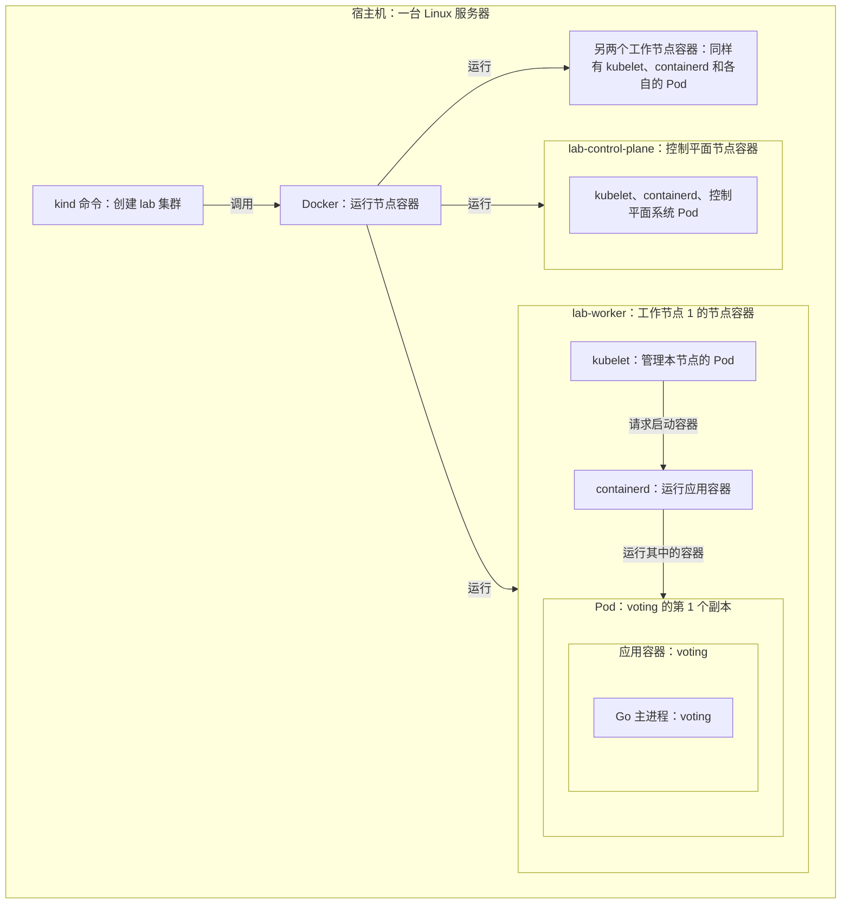
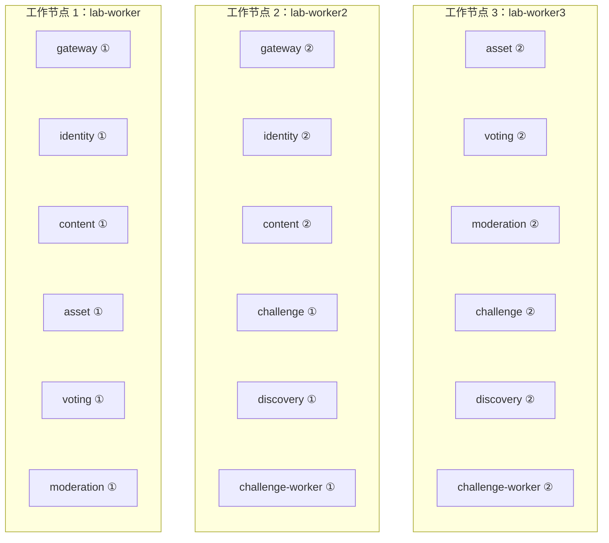

# 部署与实验计划

本文统一记录当前运行环境和后续集群方案。当前已运行的仍是 Node.js 基座与静态 Swagger；kind、Go 微服务和下列故障实验尚未部署或执行。

| 要了解什么 | 阅读位置 | 状态 |
| --- | --- | --- |
| 线上入口、开发代理、自动部署和回退 | [当前运行环境](#current-deployment) | 基座已部署 |
| 宿主机到进程、节点和副本分布、实施顺序 | [单机 kind 实验计划](#lab-plan) | 计划阶段 |
| 工具参数、资源预算和 14 项实验 | [实施参数与实验清单](#implementation-details) | 实施时查阅 |

服务职责见[架构划分](backend-architecture.md)，身份与公共基座见 [Identity 设计](backend-identity.md)。版本：v2.0 · 2026-09-18。

<a id="current-deployment"></a>
## 1. 当前运行环境

部署基座提供建设中页面与健康检查。它不代表 PRD 中的投稿、真人投票、审核或云端 agent 已实现；此处运行的是 Web/API 服务，云端挑战环境另按可信场景设计。

### 实际拓扑

| 位置 | 职责 / 地址 |
| --- | --- |
| GitHub | `KDZZZZZZ/human-worth`；PR CI 与 dev / main push CI 使用托管 runner |
| 当前本机 | systemd 运行应用和拉取控制器；应用只监听 `127.0.0.1:18090` |
| 阿里云 CLI 当前账号的 cn-beijing ECS | 公网 IP `123.56.161.234`，Nginx 监听 TCP `18090` |
| 专用 SSH 隧道 | ECS `127.0.0.1:28090` → 本机 `127.0.0.1:18090` |
| 前端 / API | `http://123.56.161.234:18090/` / `http://123.56.161.234:18090/api/health` |
| Swagger 文档 | `http://123.56.161.234:18090/docs/`；由 ECS Nginx 直接提供静态文件 |

同源 `/api/` 避免前端写死第二个主机和端口。现有 ECS 80、443、8080、18082～18084 已有其他用途，新增配置只使用本项目端口。安全组只新增 TCP 18090；28090 不对公网开放。

### 前端开发与部署的 API 路由

用户明确要求开发使用公网 API，部署使用内部调用。前端代码始终使用相对 `/api/*`，通过服务入口区分环境：

| 环境 | 启动方式 | API 请求链路 |
| --- | --- | --- |
| 前端开发 | `npm run dev:frontend`，默认 `127.0.0.1:18100` | 浏览器 → 本地开发代理 → `http://123.56.161.234:18090/api/*` |
| 已部署站点 | systemd / `npm start` | 浏览器 → 同源 Nginx `/api/*` → 网关 `127.0.0.1:28090` → 隧道内的本机应用 |

开发代理只接管 `/api/` 前缀，保留方法、查询参数、请求体和响应状态；上游不可达返回 502，不回退到本地 API。开发上游可由 `FRONTEND_API_ORIGIN` 覆盖。生产环境禁止 `--frontend-dev`，正常部署启动不会读取该变量。浏览器不直接连接内部地址，内部转发由服务端完成。

<details>
<summary>自动部署、文件权限与回退命令</summary>

### 自动部署过程

1. PR 的 `CI` 通过后 squash 合入 dev；GitHub 再运行 dev push CI。
2. 本机 `human-worth-deploy.timer` 每 60 秒启动一次控制器，拉取最新 dev SHA。
3. 控制器只接受本仓库 `.github/workflows/ci.yml` 对该 SHA、dev、push 事件的最新一次成功运行。pending、失败、缺失或其他分支 / 事件均不部署。等待 CI 时每 180 秒重试 API，避免频繁查询。
4. 再确认 dev 没被新提交替代，按 SHA 解包到 `/opt/human-worth/releases/<sha>`；不在开发者工作区部署，不执行仓库里的安装脚本。
5. 原子切换 `current` 符号链接并重启项目服务；健康检查必须返回同一 SHA。失败切回上一版本并检查恢复结果，首次部署失败则停止服务。
6. 成功记录到 `/opt/human-worth/state.json` 与 journal。应用 `/api/health` 返回当前 revision，公网验收以该值为准。

本机通常在 CI 成功后 1～3 分钟部署。机器关机或离线时不部署，重新联网后继续调和最新 dev；ECS 入口此时可能返回 502。进程重启可能产生短暂连接中断，当前不承诺零停机。main 合并不触发本机版本切换。

### 文件与权限

| 项目 | 安装位置 / 权限 |
| --- | --- |
| 应用 | `human-worth` 系统账户；release 只读，无开发者家目录访问 |
| 部署控制器 | `human-worth-deploy` 账户；写 `/opt/human-worth`；sudo 仅允许 restart / stop `human-worth.service` |
| 已安装控制器 | `/usr/local/lib/human-worth/deploy.py`；root 拥有，不由普通代码部署自动覆盖 |
| 服务与 timer | `/etc/systemd/system/human-worth*.service`、`human-worth-deploy.timer` |
| 隧道 | 独立 `human-worth-tunnel` 账户和 SSH key，私钥仅在本机 `/var/lib/human-worth-tunnel` |
| ECS 入口 | `/etc/nginx/conf.d/human-worth.conf`；独立 SSH 用户仅允许反向转发到 28090，无交互 shell 能力 |

配置源在 [ops/systemd](../ops/systemd)、[ops/nginx](../ops/nginx)、[ops/ssh](../ops/ssh)、[ops/deploy.py](../ops/deploy.py)。本机初始化入口为 `sudo bash ops/install-local.sh`，之后将新公钥写入 ECS 专用用户，并经云助手核对主机公钥后写入本机 known_hosts，启动隧道和 timer。基础设施文件经 PR 修改后由运维安装；控制器不会给仓库代码任意系统管理权限。仓库和 GitHub Actions 不保存阿里云凭据或隧道私钥。

### 检查、回退与维护

```sh
systemctl status human-worth.service human-worth-deploy.timer human-worth-tunnel.service
sudo journalctl -u human-worth-deploy.service -n 50 --no-pager
curl --fail http://127.0.0.1:18090/api/health
curl --fail http://123.56.161.234:18090/api/health
```

常规回滚：从 dev 建任务分支，以 `git revert` 撤销问题变更，经 CI / PR 合入，由控制器部署新 SHA。失败激活会自动回退；如果 API 不可达，先查看应用、隧道与 Nginx 状态，分别定位本机和公网链路。

紧急冻结调和：`sudo systemctl stop human-worth-deploy.timer`，保留当前服务，处理问题后 `sudo systemctl start human-worth-deploy.timer`。不要通过关闭 GitHub 分支保护或 force push 回滚。停止公网入口时只停止 `human-worth-tunnel.service`，不要停整台 ECS 的 Nginx。

当前保留所有已部署 release 以便诊断；定期清理时至少保留 current 与最近成功版本，不在部署并行进行时删除。部署控制器单实例文件锁防止重叠。

当前公网 HTTP 仅用于公开说明、健康检查和只读接口文档。引入身份认证、API token 或私有作品前，同一功能交付必须建立 HTTPS；不通过当前 HTTP 入口传输这些数据。

</details>

<a id="swagger-docs"></a>
<details>
<summary>Swagger 静态文档构建、发布与回退</summary>

### Swagger 静态文档

2026-09-17，用户明确要求生成 Swagger 文档并部署。该授权用于独立静态文档发布，不自动授权创建 PR，也不改变应用从受保护 dev 和成功 CI 部署的规则。源码集成仍须遵循明确的人类 PR 命令、分支保护与 CI 门槛。

源文件为根目录 [openapi.yaml](../openapi.yaml) 和 [docs/swagger](swagger)。`npm ci --ignore-scripts && npm run build:docs` 生成 `dist/docs/`，包含固定版本 Swagger UI、许可证及逐文件 SHA-256 清单。浏览器只请求同源资源，关闭在线校验器、Try it out 和授权输入。当前本地契约共 41 个操作，仅健康检查的 GET、HEAD 已实现，其余 39 个为提案；Google 登录等新增契约尚未发布，线上以实际发布版本为准。

Google 登录正式接入前必须配置 HTTPS 域名和 Google 注册回调，现有公网 HTTP/IP 地址不能直接作为正式回调。当前本地 HTTP 前端代理也尚未实现登录联调所需的回调与会话配置，具体要求见[后端身份设计](backend-identity.md)。

公网 `/docs` 重定向到 `/docs/`，对应 `/var/www/human-worth-docs/current/`。Nginx 配置只增加该前缀的静态路由，其他路径继续使用原有应用代理。静态文档不依赖本机应用在线；API 的可用性仍依赖原有隧道和服务。

发布流程：

1. 运行 `npm run ci`，在浏览器检查接口、schema、状态提示与下载。
2. 通过 ECS 云助手读取 `/etc/nginx/conf.d/human-worth.conf`，将实际内容保存到本地 `/tmp/human-worth-nginx.conf`。不要把仓库配置当成已核实的远端配置。
3. 运行 `python3 scripts/package-docs.py /tmp/human-worth-nginx.conf`。输出紧凑归档路径、SHA-256 和字节数；通过 ECS `SendFile`（Base64）上传到网关 `/var/tmp/human-worth-docs/`。大型官方资源由安装器按 lockfile 中的精确 URL 下载并校验 SHA-512；Logo 原图从公开仓库 `dev` 下载，并核对构建清单中的 SHA-256。Logo 变更须先按 PR 流程合入 `dev`；若远端图片与构建不一致，安装器在切换前拒绝发布。大文件不放进云助手归档，以满足 [SendFile 的 Base64 内容不超过 32 KB 的限制](https://www.alibabacloud.com/help/en/ecs/developer-reference/api-ecs-2014-05-26-sendfile)。
4. 通过云助手传入 [ops/install-docs.py](../ops/install-docs.py)，在网关以 root 执行 `python3 install-docs.py <归档路径> <SHA-256>`。使用 `RunCommand` 传 Base64 内容时必须显式设置 `ContentEncoding=Base64`，不要依赖 CLI 默认值。
5. 检查公网文档与 YAML、逐文件清单、浏览器渲染及 `/api/health`。部署不应改变应用 revision。

安装器在修改前核对归档、依赖、逐文件摘要及远端配置，配置漂移时拒绝覆盖。release 保存在 `/var/www/human-worth-docs/releases/<归档 SHA-256>`，旧 Nginx 配置保存在非公开的 `backups/`。通过 `nginx -t` 后原子切换文档链接、reload Nginx；发布检查失败则还原先前配置与链接。需要手动回退时恢复对应配置备份及上一 release 链接，先运行 `nginx -t`，再 `systemctl reload nginx`，复核文档和应用健康。

不要把工作区或项目根目录直接映射到公网；只有构建清单内的公开文件进入文档 release，安装归档、Nginx 配置和备份不在公开目录内。

2026-09-17 发布验收：文档归档 SHA-256 为 `46124e692ca7a77241bb633ad0f343b1fddee67faaac6a8b33fb6e98b2f8d997`。`npm run ci`、网关 `nginx -t`、公网 10 个文件摘要与私有路径拒绝检查均通过；Chrome 验证 38 个操作、展开状态、YAML 下载入口、桌面/手机布局，没有脚本异常或外部资源请求。本地开发页面的 `/api/health` 确认返回公网版本；发布前后应用 revision 均为 `813b5a8bafde7731886244dc831b9985c5884035`。首次安装发现网关 Python 3.6.8 的 pathlib 兼容性问题，修正后发布成功，现有应用服务保持正常。未实现的业务 API 不在此次运行验收范围内。

</details>

<a id="lab-plan"></a>
## 2. 单机 kind 实验计划（尚未部署）

**先在一台服务器上搭一套名为 `lab` 的实验环境，逐步把 Go 服务放进去，再练习故障处理和独立发布。所有实验共用这套配置。**

**下一步先完成七个服务的设计和 Proto，再实现第一条业务链路。** Kubernetes 集群在这之后搭建。

### 要部署什么

只使用一套 `lab`：**1 个控制平面节点 + 3 个工作节点**。每种应用先跑两份，数据库保持 1 主 2 备。下面两张图分别说明“里面有什么”和“副本放在哪里”。

#### 从宿主机到 Go 进程

图中展开的是投票服务的一个副本；其他业务 Pod 使用同样的结构。框表示包含关系，箭头表示创建或启动关系。



kind 负责搭建集群。运行时，控制平面负责调度，节点里的 kubelet 和 containerd 负责落实 Pod 配置、启动容器。**业务容器内运行 Go 程序，无需安装 Docker。**

本项目首版每个业务 Pod 放一个应用容器，启动一个业务主进程。进程可以有多个 goroutine；挑战执行器也可能启动任务子进程，这些不另算服务副本。节点内运行时与 Pod 的依据见[分层参考](references.md#microservices-lab)。

#### 每个服务如何部署

每行独立构建镜像、独立创建一个 Deployment（维护该应用副本的 K8s 配置），设置 `replicas: 2`。一个服务可以单独更新、扩容和重启。以下进程名是规划名称，尚未创建程序。

| 应用与职责 | Go 主进程名 | Pod 副本数 |
| --- | --- | --- |
| 网关：接收 HTTP / MCP 请求 | `gateway` | 2 |
| 身份：账号、会话、凭据和角色 | `identity` | 2 |
| 内容：任务、作品、投稿和评论 | `content` | 2 |
| 文件：上传、下载和文件访问权限 | `asset` | 2 |
| 投票：单选、永久资格和统计 | `voting` | 2 |
| 审核：审核决定、举报和审计查询 | `moderation` | 2 |
| 挑战：运行状态、任务分配和租约 | `challenge` | 2 |
| 发现：推荐、热度和公开看板 | `discovery` | 2 |
| 挑战执行器：领取任务、调用模型、上报结果 | `challenge-worker` | 2 |
| **合计** | **9 类应用** | **18 个业务 Pod** |

因此，业务全部实现并稳定运行后，是 **18 个业务 Pod → 18 个应用容器 → 18 个业务主进程**。系统组件、数据库和监控另算；发布或扩容期间也可能临时增加 Pod。

原来的 `platform` 作为公共 Go 代码使用，`Execution` 作为 Challenge 内部模块使用，不额外部署进程。七个业务 RPC 服务的数据和接口边界见[架构划分](backend-architecture.md)。

#### 三个工作节点上的副本分布

下面是一次正常调度可能得到的示例，每个框都是一个独立业务 Pod。①、②只是帮助阅读的副本编号，实际 Pod 名称由 K8s 生成。



这里只展示放置关系，服务之间的调用见[调用拓扑](backend-architecture.md#2-目标调用拓扑)。例如工作节点 1 停止后，Voting ② 仍在工作节点 3；它能否继续处理请求，还要看数据库等依赖是否可用。

**配置要求是同一应用的两个副本分散到不同节点，不固定绑定上图的位置。** 节点重启、故障恢复或更新后位置可能改变，仍须检查分散情况。18 个业务 Pod 平均每节点 6 个只是示例，实际还要结合资源请求和配套组件调度。

#### 数据库和配套组件放在哪里

这些组件也在工作节点上运行，但不计入上面的 18 个业务 Pod。

| 组件 | 配置与位置 | 用途 |
| --- | --- | --- |
| PostgreSQL | 3 个数据库 Pod，三个工作节点各 1 个；角色为 1 主 2 备，主库位置可切换 | 七个业务服务使用同一数据库集群，各自拥有 schema 和账号 |
| 文件存储 | 1 个实例与持久卷，调度到一个工作节点 | 保存作品文件；Asset 服务管理访问，文件不保存在 Asset Pod 的临时目录中 |
| Prometheus、Grafana、Tempo | 服务实例初期各 1 个 | 查看指标、日志关联和跨服务请求耗时 |
| 集群配套组件 | CoreDNS、Calico、CloudNativePG 管理程序等，副本与落点按安装清单配置 | 提供域名解析、网络、数据库管理；不计入业务副本数 |

控制平面节点只承担集群管理；API 服务、调度器、控制器和 etcd 等系统组件在那里运行，业务不调度到该节点。完整资源预算仍包含所有系统、数据和观测组件。

所有实验共用这套配置。扩容、停机、断网都是临时实验动作，实验结束后恢复固定配置，再做下一项。

### 按什么顺序做

| 顺序 | 做什么 | 做到什么算完成 |
| --- | --- | --- |
| **1. 定接口** | 写好七个服务的职责、数据归属和 Proto 接口 | 能说清谁保存数据、谁调用谁、失败后怎么处理；Proto 可编译 |
| 2. 跑通一条链路 | 先实现网关、身份服务和内容服务，连接真实数据库 | 一个请求能完成身份验证和内容读写；非法请求会被拒绝 |
| 3. 放进 lab | 创建 1 个控制平面、3 个工作节点和数据库三实例；首批服务各跑两份 | 请求能分到不同副本；数据库复制、网络权限和监控可检查 |
| 4. 补齐业务 | 逐步加入文件、审核、投票、发现、挑战和执行器 | 投稿、审核、投票、查看统计和挑战流程可以实际使用 |
| 5. 逐项演练 | 先测正常情况，再练故障、升级和性能 | 有请求结果、数据记录和恢复时间，能说明哪里符合预期、哪里失败 |

每个阶段都在同一套方案上推进。业务模块按开发进度加入，无需现在一次性写完或部署全部服务。

公网迁移放在实验验证之后，作为单独的发布任务处理：完成 HTTPS、切换入口、验证回退，并遵守[PR 与发布规则](../AGENTS.md#pr-authorization)。前端仍用相对 `/api`：开发时代理到公网，部署后由入口转发到内部网关。

### 能练习哪些情况

| 可以做的实验 | 主要想弄明白什么 |
| --- | --- |
| 停掉一个应用副本或工作节点 | 请求会不会失败，多久恢复，剩余副本是否真的接管 |
| 给服务之间加延迟、制造断连 | 请求能否及时结束，重试会不会重复写入数据 |
| 同时投票、查看统计，或重复提交结果 | 并发时规则是否仍成立，例如看过统计后永久不能再投该任务 |
| 运行中取消挑战，再让旧执行器提交结果 | 迟到结果是否被拒绝，作品是否会重复登记 |
| 停掉数据库主库、重启文件存储、恢复备份 | 已确认的数据是否保留，恢复后权限和投票资格是否正确 |
| 单独升级服务、增加副本和请求量 | 新旧版本是否兼容，哪里出现瓶颈，扩容是否有效 |
| 停掉唯一控制平面，再启动它 | 管理功能中断时业务表现如何，恢复后能否继续管理集群 |

每次按“**记录正常表现 → 注入一种故障 → 检查业务结果 → 撤销故障 → 再查数据**”进行。先做单个故障，之后再组合实验。

完整的 14 项检查放在[文末实验清单](#experiment-checklist)，实施对应功能时再看。

### 这套环境的边界

它能帮助我们学习服务通信、并发、重试、故障恢复和独立发布。所有节点共用一台物理机，因此无法证明服务器整机断电后仍可用，也不能代表多台机器的真实性能。

控制平面和文件存储目前都只有一份，可以练习中断与恢复；它们的高可用不在本配置范围内。现有公网入口和 SSH 隧道的可用性也需要单独验证。

**目前完成的是部署计划。下面的实验都还没有执行。**

<a id="implementation-details"></a>
## 3. 实施参数与实验清单

以下内容按需展开，不影响先理解上面的方案。

<details>
<summary>工具、配置参数与实现约束</summary>

### 工具各自做什么

| 工具 | 在本计划中的作用 |
| --- | --- |
| kind | 调用 Docker 创建 K8s 节点容器、组装 lab 集群 |
| Docker | 在宿主机上运行外层节点容器 |
| containerd | 在节点内部运行 Pod 中的应用容器，由 kind 节点镜像提供 |
| Calico | 管理集群网络，让服务访问限制生效 |
| CloudNativePG | 管理 PostgreSQL 实例、复制和主备切换 |
| Prometheus + Grafana | 采集指标并展示曲线 |
| OpenTelemetry + Tempo | 跟踪一个请求经过了哪些服务、每段花多久 |
| Go pprof | 分析某个 Go 进程的 CPU、内存等开销 |
| k6 | 发送测试请求，测量负载增加后的表现 |

安装时固定 kind、Kubernetes、Calico、CloudNativePG 等工具的版本和镜像摘要，并检查版本兼容性。只维护一套 `lab` 声明式配置；使用独立 kubeconfig、实验数据和命名空间。选型依据见[成熟参考](references.md#microservices-lab)。

### 资源与副本落点

- 规划依据是本机 4 核 8 线程、约 16GB 内存。初始实验总预算以 4 个逻辑 CPU、8GiB 内存为起点，包含控制平面、网络、DNS、三个数据库实例、文件存储和监控；先测空载开销，给宿主机和现有服务留出余量。这不是容量已足够的保证。
- 每个 Pod（K8s 调度应用实例的单位）配置 CPU/内存的 requests 和 limits。kind 各节点共用宿主机，不能把节点显示容量相加；限制节点容器时还要核对 kubelet 报告的可分配资源。
- 应用保留双副本、数据库保留三实例。资源不足先降低压测并发、遥测采样和保留时间；仍不足则记录待测项或增加宿主机资源。观测组件及 Tempo 所需存储全部计入预算。
- 挑战执行器每个副本先只同时运行 1 个任务，租约和执行记录保存在 Challenge 服务，执行器的临时工作目录可以丢弃。
- 应用使用独立 Deployment；控制平面不承载业务。按服务设置 `topologySpreadConstraints`，使用 `kubernetes.io/hostname`、`maxSkew: 1` 分散副本，并核对实际落点。滚动更新预留临时副本容量，避免过严的反亲和规则阻塞发布。[拓扑分布约束](https://kubernetes.io/docs/concepts/scheduling-eviction/topology-spread-constraints/)
- 三个工作节点支持失去一个节点后继续分散业务副本，前提是剩余容量和依赖可用。故障检测、驱逐、调度、镜像与卷都会影响恢复时间，需要实测。可用区标签只模拟调度规则，不增加物理隔离。

### 通信与权限

- HTTP/MCP 通过网关；业务服务仅提供内部 gRPC。使用 Kubernetes DNS 寻址，首版采用 Headless Service 与客户端 `round_robin`。实际检查地址更新和各副本请求量，不能仅凭副本数量判断流量已均衡。[gRPC 均衡策略](https://grpc.io/docs/guides/custom-load-balancing/)
- 请求沿调用链传递超时期限；只在一个明确层级重试，限制次数和总时间。写请求只有定义了“重试不重复执行”的规则后才允许自动重试。
- kind 关闭默认 CNI 后安装 Calico。应用网络默认拒绝未声明的访问，再按调用清单放行 DNS、RPC、数据库、文件存储和监控。NetworkPolicy 依赖支持它的网络插件，namespace 本身不构成隔离。[Calico on kind](https://docs.tigera.io/calico/latest/getting-started/kubernetes/kind)
- 服务连接使用 mTLS（双方验证证书），身份断言限定接收方和用途，服务仍需检查业务权限。挑战执行器只访问 Challenge 和受控模型出口，不直连业务库、审核或投票；动态模型域名经受控出口代理处理，普通 NetworkPolicy 不负责域名授权。
- 实验入口和 Kubernetes API 先只绑定本机，使用独立端口；不占用现有 18090、18100 或 SSH 隧道。数据库、内部 RPC、pprof 不开放到公网。

### 数据与文件

- 七个业务服务使用各自的数据库 schema 和账号，不跨服务直接读写表。数据库连接总量按所有副本计算，包含滚动更新的临时副本。
- CloudNativePG 维护 1 主 2 备，三个实例使用独立 PVC 和 PGDATA，分布到三个工作节点。初始同步策略为 `method: any`、`number: 1`、`dataDurability: required`，并按选定版本配置、验证 failover quorum。关键事务使用同步提交；副本不足时可以阻塞或拒绝写入，不自动降低持久性。[CloudNativePG 1.28 复制说明](https://cloudnative-pg.io/docs/1.28/replication/)是设计参考，实际版本在实施时固定。
- 权限和永久禁投资格读权威主库。切换时隔离旧主，只向有效主端点写入；证据不足时不强制提升落后副本。检查复制位置、写入回执和重连时间。提交超时可能意味着结果未知，重试须按业务唯一标识查回结果。
- 数据库副本不能共用同一个 PGDATA。local PV 有节点约束，节点故障后不能假设卷自动迁移；主备切换依靠各副本自己的数据。文件存储先使用一个内部实例和持久卷，应用临时目录不保存唯一作品文件。
- 恢复备份后检查作品、选票和资格。若较旧备份丢失永久禁投记录且无法补全，受影响范围保持不可投票。异机备份和异机恢复才可进一步验证整机损坏后的恢复能力。

### 发布与观测

- 每服务独立镜像和 Deployment，镜像绑定代码 SHA 与 digest。Proto 和数据库变更按“先扩展、再迁移、最后清理”兼容旧版本；回滚服务不等于回滚数据库。
- 配置启动、就绪和存活探针。下游暂时不可用不能直接触发全部服务重启。收到 SIGTERM 后停止接收新请求，限时处理在途工作；挑战执行器停止领取任务，按租约结束或等待接管。[探针说明](https://kubernetes.io/docs/tasks/configure-pod-container/configure-liveness-readiness-startup-probes/)
- 双副本服务初始设置 `maxUnavailable: 0`、`maxSurge: 1`。PDB 约束 drain 等自愿驱逐，不防止节点宕机，也不代替滚动更新策略。[中断说明](https://kubernetes.io/docs/concepts/workloads/pods/disruptions/)
- 记录延迟、错误率、CPU/内存、GC、连接池、队列和租约，并关联请求 trace。监控不读取产品具体投票统计，不采集凭据、作品正文或具体选票；管理日志不展示额度和消耗。
- 初期手动调整副本，接入指标后再测 HPA 自动扩缩容。等待调度的副本不算扩容成功。k6 在集群外发压，容量压测尽量从另一台机器发起；同机发压时记录资源竞争。

</details>

<a id="experiment-checklist"></a>
<details>
<summary>完整实验清单：14 项，全部待执行</summary>

只测试已实现的业务链路。每次从健康的固定配置开始，结束后恢复节点、业务副本和数据库复制。数据库切换实验要求控制平面和 Operator（数据库管理程序）可用；控制平面实验不同时注入数据库或工作节点故障。

| 编号 | 操作 | 需要看到的结果 |
| --- | --- | --- |
| D01 | 持续发请求，把某服务从 2 份扩到 3 份，再回到 2 份 | 地址和连接更新，新旧副本都有可查的请求量；状态不依赖固定副本；重试不重复写入 |
| D02 | 分别终止应用 Pod、drain 工作节点、突然停止工作节点 | 记录不同故障下的错误和恢复时间；结合该节点上的数据库、文件存储解释业务是否可用，并检查数据 |
| D03 | 对指定链路加延迟、丢包、单向或双向断连 | 请求有明确超时，资源能释放，重试有界；依赖无法核实时不泄露未审核内容或开放投票 |
| D04 | 写入已提交后丢弃响应，再重试；重复、乱序投递事件 | 选票不重复计数，作品不重复登记；重复回执稳定；旧事件不能恢复已下架内容 |
| D05 | 两个投票副本同时处理首次投票和查看统计，包含资格记录尚不存在的情况 | 同一账号在同一任务上的操作顺序明确；先永久关闭资格再返回统计，丢响应、换 token、重启都不能恢复资格 |
| D06 | 审核决定应用中断、重放旧决定，同时下架与投票、下载 | 中断可恢复，旧决定不能覆盖新状态；未完成不假报成功；下架完成后的新投票、下载被阻止 |
| D07 | 两个执行器交接任务，旧执行器迟到提交；同时取消和登记 | 新租约生效后旧执行器失效；终态后不新增作品；重复登记找回原结果且不重置审核 |
| D08 | 分别停止数据库主进程、让主节点失联、切断主备网络 | 只有有效主库可写；按同步策略确认成功的数据保留；无法安全切换时停止写入 |
| D09 | 中断上传、重启文件存储、恢复数据库和文件备份 | 半成品不能引用，完成文件的摘要一致；下载仍校验权限，恢复不重新开放已关闭的投票资格 |
| D10 | 单独升级一个服务并回滚，保留旧调用者和在途请求 | Proto、HTTP、数据库迁移兼容；新旧版本都遵守业务规则 |
| D11 | 停止唯一控制平面，再恢复同一节点 | 记录 API、调度和 Operator 中断及恢复，检查已有业务的实际表现；此项不验证控制平面高可用或 etcd 多节点选举 |
| D12 | 限制 CPU/内存，逐渐增加请求和副本 | 记录节流、内存不足退出、排队与恢复；测吞吐、延迟和错误率，检查重试是否重复写入 |
| D13 | 执行器越权访问、MCP token 调用管理接口、伪造身份，同时发送合法请求 | 非法请求被相应网络或权限规则拒绝，合法请求成功；同账号在网站与 MCP 的投票资格一致 |
| D14 | 准备含 10、100、1000 件过审作品的任务，同时混入未过审作品 | 候选列表包含该版本全部过审作品，用户仍只选一件，不泄露他人计票；测响应大小、序列化、内存和前端渲染；失败不能悄悄截断候选 |

每项通过都需要业务响应、持久化数据和故障记录共同支持，只看到 Pod 就绪不算通过。

执行时补充以下记录和操作约束：

- 网络故障用 `tc/netem` 和定向规则，限定在实验节点或 Pod 的网络空间，并准备自动撤销；不修改宿主机全局公网和 SSH 链路。[tc-netem](https://man7.org/linux/man-pages/man8/tc-netem.8.html)
- 重复请求、事件由实验驱动器发送；重复 TCP 数据包不等于重复执行业务操作。涉及租约交接时核对租约代次，保证旧执行器不能继续提交。
- 投票和查看统计使用独立测试账号与任务，检查业务成功，不能把快速返回 403 当作有效吞吐。模拟模型仅用于受控实验，真实供应方集成另验。
- 保存代码 SHA、镜像、配置、随机种子、数据规模、故障与清理时间、响应、日志、trace、数据库核对结果。业务延迟记录 p95/p99，性能阈值按实测确定；按[研究记录规则](../AGENTS.md#research)保存实验制品。

</details>

<details>
<summary>方案依据与文档检查范围</summary>

用户明确要求分布式 Go 架构、增加微服务学习内容，并先只使用一套实验配置。kind、工具组合、节点数、副本数、资源预算和文档组织属于 Agent Self-Claimed 的技术选择。服务边界见[架构划分](backend-architecture.md)，技术来源见[成熟参考](references.md#microservices-lab)。

本节保留宿主机到进程的分层图、九类应用的副本清单与节点分布示例。文档检查覆盖可信场景快照、本地链接、图示及副本数量的一致性。这些检查不代表 Go 服务、集群或上述实验已经完成。

2026-09-18 图示验证记录：`python3 scripts/check_docs.py` 与 `git diff --check` 退出码均为 0；两张 Mermaid 图经 Mermaid 10.9.3 与本机 Chrome 渲染、查看通过。另核对架构中的九类应用与部署清单一致，图中十八个副本无遗漏，同服务两份位于不同工作节点。渲染工具仅用于本次文档检查，未加入项目依赖。

</details>
